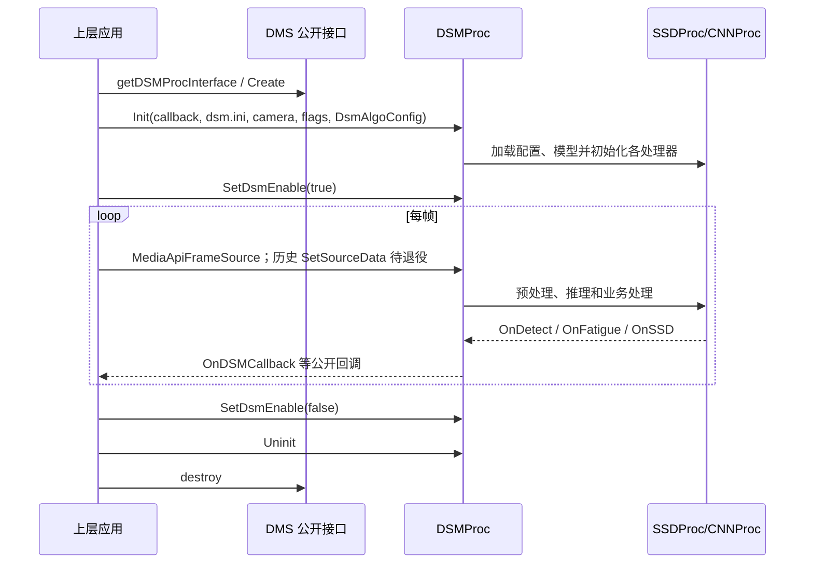

# DMS 完整调用链对比

> 状态：草稿
> 核查日期：2026-08-07
> 维护入口：[DMS 运行时统一](../README.md)
> 关联代码基线：见本文“核查范围”和[运行基线](./2026-08-07-dms-runtime-baseline.md)

本文对比 Hi3519DV500 与 RV1126B 两套 DMS 的实际调用路径，供后续公共业务代码拆分、平台接口设计和回归测试使用。结论来自固定提交中的源码，不以当前工作区的未提交修改为依据。

## 1. 核查范围

| 项目 | 固定版本 |
|---|---|
| Hi3519DV500 | `5eaf381e1ca66ecc7084a674ea61cfe21967e876` |
| RV1126B | `0f19bc6f805f6a5a385d877b62b531f9af32b0d0` |
| RV1126B SDK 子模块 | `4cc1efcaa7cbd017fd3df8313961f00e380310df` |
| RV1126B libaidsm 子模块 | `fde8f6e6416d6fdcc2f324bb26037bc824ef6212` |

核查从公开接口开始，沿初始化、送帧、预处理、推理、业务后处理、回调和释放路径追踪到仓库内能够看到的最底层实现。

以下内容不在固定源码中，因此本轮只能标成外部边界：

- 产品上层应用的真实调用代码；
- `MediaApiFrameHelper`、`MediaApiFrameIncRef` 和 `MediaApiFrameDecRef` 的实现；
- 两个平台实际使用的完整模型文件；
- 真机运行时的中间张量、线程时序和回调日志。

自测程序能够说明接口的预期用法，但不能代替产品上层和真机行为。

## 2. 对外调用顺序

两端公开接口的基本使用顺序相同：



该图记录旧实现能够看到的两条入口，不代表统一后继续保留双入口。项目目标是删除废弃的 `SetSourceData` 实现；第一阶段先核对固定 commit、上层调用和导出符号，证明它没有有效调用者且不承担 ABI 兼容责任。若仍存在兼容责任，则第二阶段只设计有明确退役版本的最薄适配。

## 3. Hi3519DV500 调用链

### 3.1 初始化

1. `DSMProc::Init` 读取传入的 `dsm.ini`；源码要求读取 12 个配置项。
2. 创建 `SSDProc`，再初始化目标检测、头姿、疲劳、关键点及按开关启用的口罩、墨镜、活体、模糊和人脸识别模块。
3. `ObjectDetYolov5s` 调用 `createNetInterface(CHIP_HISI)`，最终使用 `HisiNet`。
4. 模型主要为 `.om`，推理依赖 Hi 平台推理库和 IVE/媒体相关库。
5. 初始化期间分配固定 640×360 的 IVE 缓冲区；后续送帧路径会覆盖其中的地址字段，但固定源码中未找到对应释放代码，需要单独验证是否泄漏或依赖外部释放。

### 3.2 送帧和预处理

`MediaApiFrameSource` 的路径为：

```text
MediaApiFrameSource
  -> MediaApiFrameHelper::GetInfo
  -> 设置宽、高、格式和裁剪区域
  -> init_rga（只更新裁剪/帧信息，没有创建 RGA 实例）
  -> video_process(虚拟地址, 宽, 高, 物理地址)
  -> SSDProc::run(物理地址, 原图尺寸, 虚拟地址, 300×300×3)
```

`SSDProc::run` 根据 `csc_ive` 选择：

- 关闭 IVE：CPU `convertYUVtoRGB`；
- 开启 IVE：使用虚拟地址和物理地址执行 IVE YUV 转换。

`SetSourceData` 默认不提供物理地址。在 IVE 路径启用时，该入口是否安全不能仅凭源码确认；CPU 路径可以处理虚拟地址。这一差异是删除旧实现、收敛到明确帧输入契约的依据之一，不应把两种入口合并进新公共核心。删除前仍需完成调用者和 ABI 影响核查。

Hi 每帧都会重新计算源图和裁剪信息，对分辨率变化相对宽容，但实际支持范围仍需真机验证。

### 3.3 推理和业务处理

主流程为：

```text
SSDProc::run
  -> 目标检测推理
  -> CNNProc::OnObjectDet
  -> DetctionOutput
  -> 人脸/头部区域和状态更新
  -> 头姿、关键点、疲劳、墨镜、口罩、活体、人脸识别等分支
  -> OnDetect
  -> OnFatigue
  -> OnSSD
```

Hi 目标检测使用固定 480×288 输入，最低分数 0.7，NMS 阈值 0.45。部分分支将裁剪图直接传给 Hisi 后端，代码中没有像 RV 一样统一显式缩放到模型输入尺寸，因此迁移时要对比实际后端的隐式预处理结果。

### 3.4 回调和释放

- `OnFatigueResult` 只暂存疲劳结果；
- `OnSSDResult` 合并疲劳结果和 SSD 结果，再调用一次公开 `OnDSMCallback`；
- 合并后的结果保留到下一轮或 `Uninit`；
- `Uninit` 和析构路径会调用结果清理逻辑；
- 析构函数会调用 `Uninit`。

公开头文件允许上层在回调中对 `vector` 调用 `clear()` 以接管 `DSMData` 指针，否则由库在下一周期释放。这一约定涉及跨库内存所有权，统一实现必须原样兼容并增加重复释放、未接管和退出前残留结果测试。

## 4. RV1126B 调用链

### 4.1 初始化

1. `DSMProc::Init` 同样读取 12 个配置项。
2. `ObjectDetYolov5s` 调用 `getNetInterface()`；CMake 选择 `INFER_BACKEND_RKNN`，最终使用 `RknnNet`。
3. 预处理工厂由 CMake 选择 `PREPROC_BACKEND_ROCKCHIP`，最终使用 RGA 实现。
4. 模型主要为 `.rknn`。
5. 当前 `common_core` 的推理工厂只配置了 RKNN 和 VS816；虽然预处理目录存在 CPU 实现，现有 CMake 仍固定选择 Rockchip。现有调用链不能直接作为 x86_64 PC 后端。

### 4.2 送帧和预处理

`MediaApiFrameSource` 的路径为：

```text
MediaApiFrameSource
  -> MediaApiFrameHelper::GetInfo
  -> 强制按 YUV420SP 处理
  -> 首帧创建两个预处理器
  -> RGA：生成 300×300 BGR 目标检测输入
  -> RGA：生成原分辨率 BGR 后续人脸处理输入
  -> SSDProc::run(原分辨率 BGR, 300×300 BGR)
```

预处理器只在首帧初始化。固定源码中没有在分辨率或格式变化时重建的处理，因此动态切换输入规格可能继续使用旧参数。另有 `RunInference(cv::Mat&)` 入口，仅 RV 实现中存在。

### 4.3 推理和业务处理

业务主链与 Hi 基本相同，但下列运行语义不同：

- 目标检测最低分数为 0.3，NMS 阈值为 0.6，并从模型读取输入尺寸；
- 疲劳、关键点、头姿和口罩等分支会显式缩放到各模型输入尺寸；
- 疲劳眼部区域使用较简单的单眼区间，Hi 使用 1.5 倍扩展区域；
- 墨镜区域的边界和覆盖检查少于 Hi；
- 人脸检测和模糊模型通过文件名查找扩展名；如果同目录存在多个匹配格式，目录遍历顺序可能影响选中的文件。

### 4.4 回调和释放

RV 的公开回调行为与 Hi 不同：

- `OnFatigueResult` 立即调用一次 `OnDSMCallback`；
- `OnSSDResult` 再单独调用一次 `OnDSMCallback`；
- 两类结果没有像 Hi 一样合并；
- 析构函数为空，调用方必须显式执行 `Uninit`；
- 固定源码中没有找到与 Hi 等价的最终结果集中清理逻辑，退出前残留指针存在泄漏风险，需要动态检查。

## 5. 两端差异分类

| 项目 | Hi3519DV500 | RV1126B | 设计处理 |
|---|---|---|---|
| 推理后端 | HisiNet，OM | RknnNet，RKNN | 平台后端 |
| 帧预处理 | CPU/IVE，可能需要物理地址 | RGA，首帧初始化 | 平台后端，但输入合同需分别保留 |
| 目标检测阈值 | 0.7 / 0.45 | 0.3 / 0.6 | 产品行为，不能由平台后端隐藏 |
| 目标检测输入 | 固定 480×288 | 从模型读取 | 模型与业务合同 |
| 模型前缩放 | 部分依赖后端 | 业务侧显式缩放 | 需用中间张量确定统一方式 |
| 疲劳眼部 ROI | 扩展 1.5 倍 | 简单单眼区间 | 产品行为，需算法负责人确认 |
| 墨镜 ROI | 边界检查较完整 | 简化处理 | 业务实现差异，需回归验证 |
| DMS 结果回调 | 合并后一次 | 疲劳和 SSD 分别回调 | 对外可观察行为，必须明确兼容策略 |
| 析构行为 | 自动 `Uninit` | 空析构 | 生命周期合同，需设计统一并保留兼容 |
| 动态分辨率 | 每帧更新元数据 | 首帧固定预处理器 | 输入规格和异常处理合同 |
| 人脸模型选择 | 固定 `.om`，受宏控制 | 按 basename 查扩展名 | 模型解析策略，需改为确定性规则 |
| PC 支持 | 无 | 无可用 PC 推理后端 | 新增明确的 PC 后端和构建配置 |

上述表中，“平台后端”只表示适合放入平台实现，不表示可以改变输入输出。阈值、ROI、回调次数、顺序、结果合并和所有权都是上层能够观察到的行为。

## 6. 已确认的代码问题和疑点

以下项目应在迁移前建立回归用例，不能在搬运代码时顺手修改而不记录行为变化：

1. 两端 `DetctionOutput` 都用 `img.cols - 1` 限制 `y2`，纵坐标应当结合 `rows` 检查；
2. RV 多处初始化判断形如指针非空才检查 `init()`，工厂返回空指针时可能继续通过初始化并在后续解引用；
3. RV `mSphere` 无条件分配，但只在人脸识别开启时初始化和删除，存在泄漏疑点；
4. Hi 固定 640×360 IVE 缓冲区的地址被覆盖，固定源码中未发现明确释放；
5. RV 的 `enableSafetybelt` 没有实际初始化安全带处理器；
6. RV 无条件初始化模糊检测，`enableBlurDet` 未控制该分支；
7. RV 公共结构体新增 `enableDsmState`，改变了结构体布局，但固定源码没有使用该字段；
8. Hi 的六个业务开关均参与初始化，RV 只有人脸识别、墨镜、口罩和活体开关实际生效；
9. `libaidsm` 子模块没有出现在固定版本 DMS 的源码引用和构建链中，暂不应作为统一 DMS 的强制依赖。

这些项目需要分别标记为“保持旧行为”“修复并更新验收结果”或“等待负责人确认”。

## 7. 对统一设计的直接要求

后续设计至少要给出以下边界：

```text
两套公开兼容接口
        ↓
DMS 生命周期与结果所有权适配
        ↓
统一业务核心：状态、ROI、阈值、后处理、结果合并和告警
        ↓
平台接口：帧映射、颜色转换、缩放、模型加载、推理和缓存同步
        ↓
Hi 后端 / RV 后端 / PC 后端
```

具体要求：

- Hi 和 RV 的公共头、导出符号、库名及原有结构布局分别做 ABI 基线检查；
- 平台接口不能包含疲劳规则、阈值、ROI 和回调合并等业务决定；
- 内部帧类型必须写明格式、宽高、步长、虚拟/物理地址、缓存所有权和有效期；
- 推理接口必须写明输入布局、颜色空间、量化参数、缩放方式和输出张量定义；
- 回调适配层必须明确每帧可能回调几次、顺序、线程、结果有效期和谁释放内存；
- PC 后端是新的实现任务，不能用现有 RV 的 CPU 预处理目录推断为已经支持；
- 业务差异确认前，先允许基线策略按平台选择，待中间结果和产品验收一致后再收敛。

## 8. 当前结论和待补材料

源码层调用链已经追踪到固定仓库边界，可以开始设计模块边界，但尚不能认定运行行为基线完整。

仍需补齐：

- 产品上层最小调用程序，确认实际接口顺序和析构依赖；
- `MediaApiFrameHelper` 及帧引用计数实现；
- Hi、RV 各一套实际模型、配置和运行库；
- 同一段输入在两块板上的分段输出：预处理图、目标检测框、关键点、头姿、疲劳状态和最终回调；
- 回调线程、次数、顺序、结果接管和退出释放的动态测试；
- 分辨率变化、空帧、模型缺失、重复初始化和异常退出测试。

这些材料补齐后，才能确定哪些差异是模型差异、平台后端差异，哪些必须由统一业务核心保留。
