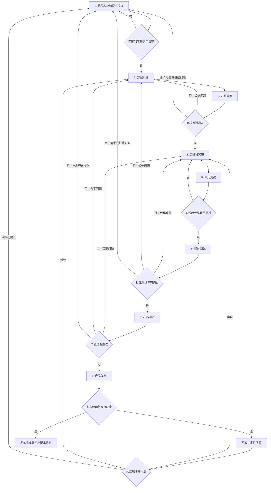

# DMS 统一项目总体流程

> 状态：草稿
> 制定日期：2026-08-07
> 维护入口：[DMS 运行时统一](../README.md)
> 适用范围：Hi3519DV500、RV1126B、x86_64 PC

本文规定 DMS 从前期核查到产品发布的完整过程。Hi3519DV500、RV1126B 和 x86_64 PC 共用这套流程。

流程分为八个阶段：

1. 设计前的范围收敛和深度核查；
2. 方案设计；
3. 方案审核；
4. 方案实施；
5. 单元测试；
6. 整体测试；
7. 产品测试；
8. 产品发布。

八个阶段表示责任和质量关口，不表示所有工作只能串行。单元测试随代码一起编写，整体测试环境可以在实施期间准备，发布材料也可以提前整理。但前一阶段没有达到退出条件时，不能把后一阶段的结果当作项目已经通过。

## 总体流程图

## 怎样理解这套流程

### 1. 范围收敛和深度核查

这一阶段回答“要改什么、不能改什么、现状到底是什么”。如果这里含糊，后面的目录设计和代码抽取很容易建立在错误假设上。

主要工作：

- 确认本次只迁移 DMS，明确 Hi3519DV500、RV1126B 和 PC 的支持范围；
- 固定两个旧仓库、SDK 子模块、模型、配置、工具链和交付库版本；
- 收集现有公共头、库名、导出符号、安装路径和最小上层调用程序；
- 沿输入、预处理、推理、后处理、跨帧状态、告警、回调和资源释放比较两套 DMS；
- 区分平台差异、产品规则、历史缺陷和暂时无法确认的问题；
- 找到需要算法、产品或板端负责人决定的事项；
- 盘点日志、图片保存、性能统计、版本诊断、配置和错误处理等横切能力，记录两端差异、调用点和业务耦合；
- 盘点废弃接口和实现，尤其是 `SetSourceData` 的调用者、导出符号、替代入口与删除条件；
- 对 `cnn_proc.cpp`、`dsmk_proc.cpp` 做函数级职责归类，记录共享状态、线程、平台依赖和候选模块边界。

阶段输出：

- 已确认的范围与兼容要求；
- 固定的源码和运行制品基线；
- DMS 完整调用链；
- 两个平台的差异清单；
- 风险、待确认问题和负责人；
- 日志、图片保存等横切能力的现状矩阵和去留建议；
- 废弃代码清单、无调用证据、ABI 影响与替代路径；
- `cnn_proc.cpp`、`dsmk_proc.cpp` 的函数级职责矩阵和候选模块图。

满足以下条件后进入方案设计：

- 每项关键行为都能定位到源码、模型、配置和运行环境；
- 两个平台的差异已经列出，原因不明的项目没有被擅自合并；
- API、ABI、库名、配置和部署路径的兼容范围已经明确；
- 产品范围和不做事项已经由项目负责人确认。
- 日志和图片保存已完成两端现状盘点，业务核心与诊断能力的耦合点均可定位；
- 每项拟删除代码都有调用者搜索、ABI 影响、替代入口和确认人，`SetSourceData` 的退役条件已经明确；
- `cnn_proc.cpp`、`dsmk_proc.cpp` 的函数和共享状态全部完成职责归类，没有“迁移时再看”的未分类区域。

当前状态：第一阶段尚未结束。范围、源码 commit、公共接口和主调用链已经核查；RV DMS 主库已绑定到固定代码树，配置源码清单也已建立。仍缺少 Hi 的干净可追溯运行库、两端设备实际配置、完整模型及其哈希、真实上层调用和真机分段结果；同时尚未完成日志、图片保存等横切能力盘点，`SetSourceData` 退役证据，以及 `cnn_proc.cpp`、`dsmk_proc.cpp` 的函数级职责归类。详见 [DMS 完整调用链对比](./2026-08-07-dms-call-chain-comparison.md)、[DMS 交付制品、模型与配置基线](./2026-08-07-dms-runtime-baseline.md) 和 [第一阶段代码治理核查清单](./2026-08-18-dms-phase-1-code-governance-inventory.md)。

### 2. 方案设计

这一阶段把核查结果转成可以编码的结构和接口。设计应直接回答代码放在哪里、模块怎样调用、平台差异如何隔离、旧接口如何保留，以及每一步怎样验证。

方案至少包括：

- `dms-deploy` 与 `algo-base` 的目标目录和依赖方向；
- DMS 公共业务核心的职责；
- 从 `cnn_proc.cpp`、`dsmk_proc.cpp` 职责矩阵导出的模块划分，包括生命周期编排、帧适配、推理、感知后处理、跨帧判决和各 DSM 子功能；
- Hi、RV、PC 平台后端的接口和职责；
- Hi、RV 两套外部 API/ABI 兼容层；
- 废弃接口的删除清单、兼容期限和替代入口，明确 `SetSourceData` 是直接删除还是短期薄适配；
- 帧、张量、检测结果、时间戳和错误码的内部数据定义；
- 初始化、启停、送帧、回调和退出状态机；
- 线程、队列、背压、帧所有权和异常处理；
- 模型、配置、日志、版本查询和安装方式；
- 日志与图片保存的诊断接口、平台后端、开关、队列、失败隔离、磁盘治理和数据权限；
- CMake、SDK、工具链及 `algo-base` 版本绑定；
- 分阶段迁移顺序、双轨验证和回滚办法；
- 单元、整体和产品测试范围。

完成的设计应让开发人员不必重新猜测模块边界和兼容策略。如果关键接口只有概念描述，没有函数职责、数据所有权、错误处理和调用时序，方案仍不能用于实施。

### 3. 方案审核

方案审核不是文字校对。审核人要确认方案能够解决两套代码重复维护的问题，同时不会破坏现有产品。

建议参加人员：

- DMS 算法负责人；
- Hi3519DV500 和 RV1126B 板端负责人；
- 上层应用接口负责人；
- 构建和发布负责人；
- 测试负责人；
- 产品负责人。

审核重点：

- 公共核心是否混入平台 SDK 或产品专用逻辑；
- `algo-base` 是否只包含已有调用方的底层能力；
- 两套旧 API、ABI、库名和配置是否能够保持；
- 内存所有权、线程和失败路径是否完整；
- 迁移步骤能否逐步验证和回滚；
- 测试方案能否发现两个旧实现之间的行为遗漏；
- 发布版本能否追溯到源码、模型、配置和工具链。

审核结论分为通过、有条件通过和不通过。有条件通过必须列出待办、负责人和完成期限；影响接口、数据语义或迁移安全的问题处理完之前不能开始相应代码。审核发现基线错误时退回第一阶段，发现设计缺失时退回第二阶段。

### 4. 方案实施

实施按照设计中的迁移切片逐步进行，不一次性搬完整个目录。建议顺序为：

1. 建立统一构建入口和平台识别方式；
2. 建立内部数据类型和平台后端接口；
3. 按职责矩阵建立生命周期、帧适配、推理、感知后处理、行为判决、配置和诊断模块骨架；
4. 接入 PC 后端，形成快速回归能力；
5. 接入 Hi 和 RV 推理、预处理及帧适配；
6. 按 DSM 子功能迁移后处理、状态机和告警逻辑，不再延续 `cnn_proc.cpp`、`dsmk_proc.cpp` 两文件聚合；
7. 接入统一日志和图片诊断模块，验证关闭与失败场景不影响主算法；
8. 接入两套外部兼容层；证据满足时删除 `SetSourceData`，仍有兼容责任时只实现已评审的短期薄适配；
9. 将已经证明适合复用的能力迁入 `algo-base`；
10. 删除已被替代的旧文件、旧路径、临时调试代码和无效平台宏。

每个切片都要能单独编译、测试和回退。实施中发现设计与源码事实不符时，应先更新差异记录和设计，经过相关人员确认后再继续，不能用临时条件编译长期绕过。

### 5. 单元测试

单元测试主要验证模块内部逻辑和明确的接口合同，由开发人员随代码一起提交。本阶段作为质量关口，检查所有迁移切片是否具备必要测试。

重点覆盖：

- DMS 过滤、状态转换、计时和告警规则；
- 坐标、阈值、裁剪、缩放和格式转换；
- 配置解析、默认值和非法输入；
- 平台接口的成功、失败、超时和不支持路径；
- 队列满、空结果、重复初始化和重复释放；
- 模型输出到内部结果的解析；
- 已发现历史缺陷的回归用例。

硬件 SDK 难以直接运行时，可使用接口替身验证调用顺序和错误处理，但替身测试不能代替真机测试。每个缺陷修复都应增加能够复现原问题的测试。

只有相关单元测试通过、编译告警和静态检查达到项目要求，并且代码评审完成后，该迁移切片才能进入整体测试。

### 6. 整体测试

整体测试验证 DMS、`algo-base`、平台 SDK、模型、配置和外部兼容层组合后的行为。测试对象是完整系统，不只是一组库能否链接。

至少包括：

- 原上层程序不改代码即可编译、链接和运行；
- Hi3519DV500、RV1126B 和 PC 的功能回归；
- 输入到最终告警的分段结果对比；
- 初始化、启停、并发、异常、资源释放和长时间运行；
- FPS、时延、内存和启动时间；
- 导出符号、SONAME、动态依赖和实际加载路径；
- 安装、升级、降级和回滚；
- 日志、版本查询和故障定位信息。

整体测试失败后先分类。代码错误退回实施；模块边界、接口或生命周期设计错误退回方案设计；基线或需求错误退回第一阶段。修复后重跑受影响测试，并检查可能受到影响的其他平台。

### 7. 产品测试

产品测试由真实使用方式决定是否可以交付。它关注车辆场景、告警效果、上层交互和现场稳定性，不重复替代开发侧的单元测试。

测试应覆盖：

- 产品要求中的典型、边界和异常场景；
- 两个平台现有功能是否遗漏；
- 告警类型、时机、持续时间和恢复条件；
- 上层应用、配置、日志和升级流程；
- 实际模型和真实设备上的性能与稳定性；
- 已知限制是否能够接受。

产品负责人和测试负责人共同确认结果。任何偏差都要记录复现条件、期望结果和影响范围。产品要求发生变化时回到第一阶段重新确认范围，而不是直接让开发修改代码。

### 8. 产品发布

发布前检查：

- 方案审核、代码评审和各级测试已经通过；
- 未解决问题均已评估，阻塞项为零；
- DMS、`algo-base`、SDK、模型、配置和工具链版本已经绑定；
- 安装包、升级和回滚脚本验证通过；
- 发布说明列出兼容范围、已知限制和回滚条件；
- 旧版本产物可取回，现场问题能够定位实际加载版本。

发布采用可回退的方式进行。条件允许时先在有限设备或环境验证，再扩大范围。观察期内监控初始化失败、告警异常、崩溃、内存、性能和版本加载情况。出现严重问题先回滚，再根据原因退回范围核查、方案设计或实施阶段。

观察期通过后，归档发布清单、测试结果、已知问题和回滚版本。此时产品发布才算完成。

## 贯穿各阶段的工作

以下工作不单独占一个阶段，但从项目开始一直持续到发布结束：

- **变更控制**：范围、接口、模型、配置或兼容要求发生变化时，先判断影响，再回到对应阶段更新结论。不能只改代码而不修订设计和测试。
- **代码评审**：每个迁移切片合入前检查依赖方向、平台隔离、资源生命周期、错误处理和测试。代码评审属于实施过程，不能由最终整体测试代替。
- **版本绑定**：所有测试结果和问题都记录实际使用的源码、`algo-base`、SDK、模型、配置及构建类型，避免同一问题在不同制品上反复排查。
- **问题跟踪**：问题记录复现条件、影响平台、责任人、计划版本和关闭依据。发现同类问题时检查另外两个平台，防止只修一端。
- **文档同步**：设计或实现发生实质变化时更新对应章节。提交记录保存修改过程，长期文档只保留当前有效的结构、决定和限制。
- **自动化检查**：能在 PC 或 CI 执行的编译、单元测试、ABI 检查和静态检查尽量自动运行；板端和产品测试仍由真实设备与场景完成。
- **资产与依赖检查**：模型、第三方库、工具链和测试数据要明确来源、版本、访问权限及发布限制。

这些工作各有具体落点，不另外维护一套与项目脱节的流程记录。

## 各阶段由谁负责

| 阶段 | 主负责人 | 主要参与者 | 谁确认通过 |
|---|---|---|---|
| 范围收敛和核查 | 项目负责人、DMS 算法负责人 | 平台、产品、测试、上层应用 | 项目负责人和相关业务负责人 |
| 方案设计 | 架构或主开发负责人 | DMS、平台、构建、测试 | 进入方案审核，不自行判定通过 |
| 方案审核 | 项目负责人 | 算法、平台、应用、构建、测试、产品 | 指定审核人共同确认 |
| 方案实施 | 各模块开发负责人 | 代码评审人 | 模块负责人和评审人 |
| 单元测试 | 开发负责人 | 测试人员提供建议 | 模块负责人 |
| 整体测试 | 测试负责人 | 开发、平台、构建 | 测试负责人和项目负责人 |
| 产品测试 | 产品测试负责人 | 产品、算法、现场人员 | 产品负责人和测试负责人 |
| 产品发布 | 发布负责人 | 项目、开发、测试、运维或现场人员 | 有发布权限的负责人 |

具体姓名可以后续填写，但职责不能空缺。同一人可以承担多个角色，确认标准不能因此降低。

## 文档怎样对应流程

| 阶段 | 当前或计划中的文档 |
|---|---|
| 范围收敛和核查 | [范围和约束](./2026-08-07-dms-unification-scope-and-constraints.md)、[平台统一核查](./2026-08-07-dms-platform-unification-audit.md)、[完整调用链对比](./2026-08-07-dms-call-chain-comparison.md)、[运行基线](./2026-08-07-dms-runtime-baseline.md) |
| 方案设计 | 后续总体设计文档，包含接口、目录、时序、迁移和验收设计 |
| 方案审核 | 设计文档中的审核记录和未解决项 |
| 方案实施 | 迁移任务清单、代码提交和必要的设计修订 |
| 单元测试 | 随源码维护的测试代码和测试结果 |
| 整体测试 | 整体测试方案与报告 |
| 产品测试 | 产品测试方案与验收报告 |
| 产品发布 | 发布清单、版本清单、发布说明和回滚记录 |

不提前建立空文档。进入某一阶段、开始产生需要长期保留的内容时，再创建相应文件。

## 整个项目何时算完成

只有同时满足以下条件，DMS 统一项目才算完成：

- Hi 和 RV 不再分别维护两套 DMS 业务核心；
- PC、Hi 和 RV 使用同一套经过验证的业务逻辑；
- 两个平台原有 API、ABI、库名和配置保持兼容；
- `dms-deploy` 与 `algo-base` 的版本能够准确配对；
- 单元、整体和产品测试均通过；
- 发布产物能够安装、升级、回滚和追溯；
- 发布观察期内没有未处理的阻塞问题；
- 后续修改有明确仓库、负责人和验证路径，不再依赖同时手工修改两份代码。
