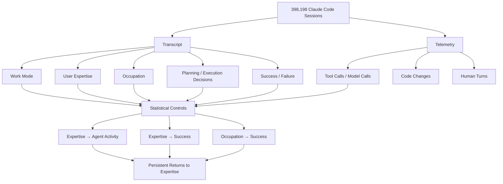
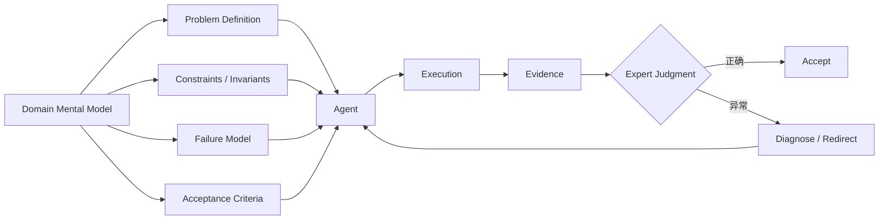

# 论文阅读-Anthropic-01

**User:** Anonymous  
**Created:** 8/19/2026 10:22:36  
**Updated:** 8/20/2026 14:21:45  
**Exported:** 8/20/2026 14:51:55  
**Link:** [https://chatgpt.com/g/g-p-69c0d4187ddc8191b951d7eb5a720e4f/c/6a85133b-c670-83ea-8d28-f7b7325c6001](https://chatgpt.com/g/g-p-69c0d4187ddc8191b951d7eb5a720e4f/c/6a85133b-c670-83ea-8d28-f7b7325c6001)  

## Prompt:
2026/8/19 10:22:36

- [Aug 18, 2026ScienceHow Claude is accelerating protein design and analytical chemistry](https://www.anthropic.com/research/Claude-accelerates-protein-design)
- [Aug 13, 2026Frontier Red Team](https://www.anthropic.com/research/multiagent-systems)

  [Patterns and problems in emerging multiagent systems](https://www.anthropic.com/research/multiagent-systems)
- [Aug 12, 2026Economic Research](https://www.anthropic.com/research/reviewing-the-evidence-on-worker-retraining-programs)

  [Reviewing the evidence on worker retraining programs](https://www.anthropic.com/research/reviewing-the-evidence-on-worker-retraining-programs)
- [Aug 10, 2026Science](https://www.anthropic.com/research/riemann-zeta)

  [Learning more about Claude's mathematical capabilities](https://www.anthropic.com/research/riemann-zeta)
- [Jul 28, 2026Frontier Red Team](https://www.anthropic.com/research/discovering-cryptographic-weaknesses)

  [Discovering cryptographic weaknesses with Claude](https://www.anthropic.com/research/discovering-cryptographic-weaknesses)
- [Jul 24, 2026Frontier Red Team](https://www.anthropic.com/research/project-pilot)

  [Project Pilot: Can AI control a drone?](https://www.anthropic.com/research/project-pilot)
- [Jul 14, 2026Economic Research](https://www.anthropic.com/research/how-canada-uses-claude)

  [How Canada uses Claude: Findings from the Anthropic Economic Index](https://www.anthropic.com/research/how-canada-uses-claude)
- [Jul 13, 2026Societal Impacts](https://www.anthropic.com/research/claude-values-models-languages)

  [Claude’s values across models and languages](https://www.anthropic.com/research/claude-values-models-languages)
- [Jul 9, 2026Frontier Red Team](https://www.anthropic.com/research/claude-plays-robotics)

  [Claude plays robotics](https://www.anthropic.com/research/claude-plays-robotics)
- [Jul 8, 2026Alignment](https://www.anthropic.com/research/off-switch-dual-use)

  [An off switch for dual-use knowledge in AI models](https://www.anthropic.com/research/off-switch-dual-use)
- [Jul 6, 2026Interpretability](https://www.anthropic.com/research/global-workspace)

  [A global workspace in language models](https://www.anthropic.com/research/global-workspace)
- [Jun 26, 2026Economic Research](https://www.anthropic.com/research/economic-index-june-2026-report)

  [Anthropic Economic Index report: Cadences](https://www.anthropic.com/research/economic-index-june-2026-report)
- [Jun 18, 2026Frontier Red Team](https://www.anthropic.com/research/project-fetch-phase-two)

  [Project Fetch: Phase two](https://www.anthropic.com/research/project-fetch-phase-two)
- [Jun 16, 2026Economic Research](https://www.anthropic.com/research/claude-code-expertise)

  [Agentic coding and persistent returns to expertise](https://www.anthropic.com/research/claude-code-expertise)
- [Jun 8, 2026Science](https://www.anthropic.com/research/agents-in-biology)

  [Paving the way for agents in biology](https://www.anthropic.com/research/agents-in-biology)
- [Jun 8, 2026Frontier Red Team](https://www.anthropic.com/research/n-days)

  [Measuring LLMs’ impact on N-day exploits](https://www.anthropic.com/research/n-days)
- [Jun 5, 2026Science](https://www.anthropic.com/research/making-claude-a-chemist)

  [Making Claude a chemist](https://www.anthropic.com/research/making-claude-a-chemist)
- [Jun 3, 2026Frontier Red Team](https://www.anthropic.com/research/attack-navigator)

  [Mapping AI-enabled cyber threats: Insights from the LLM ATT&CK Navigator](https://www.anthropic.com/research/attack-navigator)
- [Jun 3, 2026Policy](https://www.anthropic.com/news/AI-enabled-cyber-threats-mitre-attack)

  [What we learned mapping a year’s worth of AI-enabled cyber threats](https://www.anthropic.com/news/AI-enabled-cyber-threats-mitre-attack)
- [May 27, 2026Economic Research](https://www.anthropic.com/research/coding-agents-social-sciences)

  [Coding agents in the social sciences](https://www.anthropic.com/research/coding-agents-social-sciences)
- [May 22, 2026Announcements](https://www.anthropic.com/research/glasswing-initial-update)

  [Project Glasswing: An initial update](https://www.anthropic.com/research/glasswing-initial-update)
- [May 22, 2026Frontier Red Team](https://www.anthropic.com/research/exploit-evals)

  [Measuring LLMs’ ability to develop exploits](https://www.anthropic.com/research/exploit-evals)
- [May 14, 2026Policy](https://www.anthropic.com/research/2028-ai-leadership)

  [2028: Two scenarios for global AI leadership](https://www.anthropic.com/research/2028-ai-leadership)
- [May 8, 2026Alignment](https://www.anthropic.com/research/teaching-claude-why)

  [Teaching Claude why](https://www.anthropic.com/research/teaching-claude-why)
- [May 7, 2026Interpretability](https://www.anthropic.com/research/natural-language-autoencoders)

  [Natural Language Autoencoders: Turning Claude’s thoughts into text](https://www.anthropic.com/research/natural-language-autoencoders)
- [May 7, 2026Alignment](https://www.anthropic.com/research/donating-open-source-petri)

  [Donating our open-source alignment tool](https://www.anthropic.com/research/donating-open-source-petri)
- [May 7, 2026Policy](https://www.anthropic.com/research/anthropic-institute-agenda)

  [Focus areas for The Anthropic Institute](https://www.anthropic.com/research/anthropic-institute-agenda)
- [Apr 30, 2026Societal Impacts](https://www.anthropic.com/research/claude-personal-guidance)

  [How people ask Claude for personal guidance](https://www.anthropic.com/research/claude-personal-guidance)
- [Apr 29, 2026Science](https://www.anthropic.com/research/Evaluating-Claude-For-Bioinformatics-With-BioMysteryBench)

  [Evaluating Claude’s bioinformatics research capabilities with BioMysteryBench](https://www.anthropic.com/research/Evaluating-Claude-For-Bioinformatics-With-BioMysteryBench)
- [Apr 22, 2026Economic Research](https://www.anthropic.com/research/economic-index-survey-announcement)

  [Announcing the Anthropic Economic Index Survey](https://www.anthropic.com/research/economic-index-survey-announcement)
- [Apr 22, 2026Economic Research](https://www.anthropic.com/research/81k-economics)

  [What 81,000 people told us about the economics of AI](https://www.anthropic.com/research/81k-economics)
- [Apr 14, 2026Alignment](https://www.anthropic.com/research/automated-alignment-researchers)

  [Automated Alignment Researchers: Using large language models to scale scalable oversight](https://www.anthropic.com/research/automated-alignment-researchers)
- [Apr 9, 2026Policy](https://www.anthropic.com/research/trustworthy-agents)

  [Trustworthy agents in practice](https://www.anthropic.com/research/trustworthy-agents)
- [Apr 7, 2026Frontier Red Team](https://www.anthropic.com/research/mythos-preview)

  [Assessing Claude Mythos Preview’s cybersecurity capabilities](https://www.anthropic.com/research/mythos-preview)
- [Apr 2, 2026Interpretability](https://www.anthropic.com/research/emotion-concepts-function)

  [Emotion concepts and their function in a large language model](https://www.anthropic.com/research/emotion-concepts-function)
- [Mar 31, 2026Economic Research](https://www.anthropic.com/research/how-australia-uses-claude)

  [How Australia Uses Claude: Findings from the Anthropic Economic Index](https://www.anthropic.com/research/how-australia-uses-claude)
- [Mar 24, 2026Economic Research](https://www.anthropic.com/research/economic-index-march-2026-report)

  [Anthropic Economic Index report: Learning curves](https://www.anthropic.com/research/economic-index-march-2026-report)
- [Mar 23, 2026Science](https://www.anthropic.com/research/introducing-anthropic-science)

  [Introducing our Science Blog](https://www.anthropic.com/research/introducing-anthropic-science)
- [Mar 23, 2026Science](https://www.anthropic.com/research/long-running-Claude)

  [Long-running Claude for scientific computing](https://www.anthropic.com/research/long-running-Claude)
- [Mar 23, 2026Science](https://www.anthropic.com/research/vibe-physics)

  [Vibe physics: The AI grad student](https://www.anthropic.com/research/vibe-physics)
- [Mar 13, 2026Interpretability](https://www.anthropic.com/research/diff-tool)

  [A “diff” tool for AI: Finding behavioral differences in new models](https://www.anthropic.com/research/diff-tool)
- [Mar 6, 2026Policy](https://www.anthropic.com/news/mozilla-firefox-security)

  [Partnering with Mozilla to improve Firefox’s security](https://www.anthropic.com/news/mozilla-firefox-security)
- [Mar 6, 2026Frontier Red Team](https://www.anthropic.com/research/exploit)

  [Reverse engineering Claude's CVE-2026-2796 exploit](https://www.anthropic.com/research/exploit)
- [Mar 5, 2026Economic Research](https://www.anthropic.com/research/labor-market-impacts)

  [Labor market impacts of AI: A new measure and early evidence](https://www.anthropic.com/research/labor-market-impacts)
- [Feb 25, 2026Alignment](https://www.anthropic.com/research/deprecation-updates-opus-3)

  [An update on our model deprecation commitments for Claude Opus 3](https://www.anthropic.com/research/deprecation-updates-opus-3)
- [Feb 23, 2026Alignment](https://www.anthropic.com/research/persona-selection-model)

  [The persona selection model](https://www.anthropic.com/research/persona-selection-model)
- [Feb 23, 2026Announcements](https://www.anthropic.com/research/AI-fluency-index)

  [Anthropic Education Report: The AI Fluency Index](https://www.anthropic.com/research/AI-fluency-index)
- [Feb 18, 2026Societal Impacts](https://www.anthropic.com/research/measuring-agent-autonomy)

  [Measuring AI agent autonomy in practice](https://www.anthropic.com/research/measuring-agent-autonomy)
- [Feb 16, 2026Economic Research](https://www.anthropic.com/research/india-brief-economic-index)

  [India Country Brief: The Anthropic Economic Index](https://www.anthropic.com/research/india-brief-economic-index)
- [Feb 5, 2026Frontier Red Team](https://www.anthropic.com/research/zero-days)

  [Evaluating and mitigating the growing risk of LLM-discovered 0-days](https://www.anthropic.com/research/zero-days)
- [Jan 29, 2026Alignment](https://www.anthropic.com/research/AI-assistance-coding-skills)

  [How AI assistance impacts the formation of coding skills](https://www.anthropic.com/research/AI-assistance-coding-skills)
- [Jan 28, 2026Alignment](https://www.anthropic.com/research/disempowerment-patterns)

  [Disempowerment patterns in real-world AI usage](https://www.anthropic.com/research/disempowerment-patterns)
- [Jan 22, 2026Announcements](https://www.anthropic.com/news/claude-new-constitution)

  [Claude's new constitution](https://www.anthropic.com/news/claude-new-constitution)
- [Jan 19, 2026Interpretability](https://www.anthropic.com/research/assistant-axis)

  [The assistant axis: situating and stabilizing the character of large language models](https://www.anthropic.com/research/assistant-axis)
- [Jan 16, 2026Frontier Red Team](https://www.anthropic.com/research/cyber-toolkits-update)

  [AI models are showing a greater ability to find and exploit vulnerabilities on realistic cyber ranges](https://www.anthropic.com/research/cyber-toolkits-update)
- [Jan 15, 2026Economic Research](https://www.anthropic.com/research/economic-index-primitives)

  [Anthropic Economic Index: New building blocks for understanding AI use](https://www.anthropic.com/research/economic-index-primitives)
- [Jan 15, 2026Economic Research](https://www.anthropic.com/research/anthropic-economic-index-january-2026-report)

  [Anthropic Economic Index report: Economic primitives](https://www.anthropic.com/research/anthropic-economic-index-january-2026-report)
- [Jan 14, 2026Frontier Red Team](https://www.anthropic.com/research/property-based-testing)

  [Finding bugs across the Python ecosystem with Claude and property-based testing](https://www.anthropic.com/research/property-based-testing)
- [Jan 9, 2026Alignment](https://www.anthropic.com/research/next-generation-constitutional-classifiers)

  [Next-generation Constitutional Classifiers: More efficient protection against universal jailbreaks](https://www.anthropic.com/research/next-generation-constitutional-classifiers)
- [Jan 8, 2026Frontier Red Team](https://www.anthropic.com/research/critical-infrastructure-defense)

  [Experimenting with AI to defend critical infrastructure](https://www.anthropic.com/research/critical-infrastructure-defense)

这是anthropic 2026年的所有Research文章。
帮我梳理一下。并告诉我最先应该深入读哪个？

## Response:
2026/8/19 10:22:42

我会按“研究主线—代表文章—与你当前工程问题的关联—阅读优先级”来梳理，而不是按时间顺序逐篇复述。重点会区分：哪些是在研究模型本身，哪些是在研究 Agent，哪些是在研究“AI 如何进入真实工作流”。

已经可以先给一个结论：**不要从 8 月 13 日那篇 Multiagent 开始。** 它很新、也很吸引眼球，但更像“下一阶段的问题定义”。要理解 Anthropic 2026 年真正形成的 Agent 方法论，应该先从一篇有大规模真实使用数据的文章进入。

> **梳理研究脉络**
>
> 我会先核对这些文章的主题与时间，再按“智能体能力、工程系统、评测与治理”归类。结合用户关注的编码智能体，我优先建议深入阅读长周期任务、工具调用可靠性和评测方法相关研究。
>
> **梳理研究脉络**
>
> 
>
> **正在搜索网页**
>
> [Effective harnesses for long-running agents](https://www.anthropic.com/engineering/effective-harnesses-for-long-running-agents)
> [MULTI Definition & Meaning](https://www.dictionary.com/browse/multi)
> [LONG Definition & Meaning](https://www.merriam-webster.com/dictionary/long)
> [Building Effective AI Agents: Architecture Patterns and ...](https://resources.anthropic.com/hubfs/Building%20Effective%20AI%20Agents-%20Architecture%20Patterns%20and%20Implementation%20Frameworks.pdf)
> [Word Root: multi- (Prefix)](https://membean.com/roots/multi-many)
> [Research](https://en.wikipedia.org/wiki/Research)
> [Multi— Multiplayer Collaboration for MacOS](https://multi.app/)
> [Automated Weak-to-Strong Researcher](https://alignment.anthropic.com/2026/automated-w2s-researcher/)
> [RESEARCH | English meaning - Cambridge Dictionary](https://dictionary.cambridge.org/dictionary/english/research)
> [multi- - Wiktionary, the free dictionary](https://en.wiktionary.org/wiki/multi-)
> [What is Research?](https://www.hampshire.edu/offices/office-dean-faculty/irb-research-human-subjects/irb-general-information/what-research)
> [what is the exact meaning of the word 'long' as a verb?](https://www.reddit.com/r/EnglishLearning/comments/wicla8/what_is_the_exact_meaning_of_the_word_long_as_a/)
> [Multi Me - Support Networking](https://www.multime.com/)
> [Multiple vs Multi - word usage](https://english.stackexchange.com/questions/252477/multiple-vs-multi)
>
> **已搜索 14 个网站**
>
> 
>
> **正在搜索网页**
>
> [How Claude Code is used in practice \ Anthropic](https://www.anthropic.com/research/claude-code-expertise)
>
> **已搜索 1 个网站**
>
> 
>
> 思考了 49s

你这份列表非常有价值，因为按时间线看容易觉得 Anthropic 2026 年“东一篇、西一篇”；但按研究问题重新组织后，主线其实相当清楚。

我的结论先放前面：

> **第一篇深入读：2026-06-16《Agentic coding and persistent returns to expertise》**
>
> 不是最新的 Multiagent，也不是最炫的 Riemann zeta、Global Workspace，而是这篇。
>
> 因为它回答的是一个更底层的问题：**当 Agent 已经足够强之后，人究竟还负责什么？人的专业能力还有什么价值？Agent 与专家应该怎样分工？**
>
> 这实际上是理解 Anthropic 2026 年 Agent、Harness、Claude Code、long-running agent、multiagent、AI for Science 等一系列工作的“总入口”。

Anthropic 用约 40 万个真实 Claude Code session 做分析，得到一个非常重要的经验结构：**人主要决定 what，Claude 主要决定 how**；典型 session 中，人承担约 70% 的 planning decisions，而 Claude 承担约 80% 的 execution decisions。并且真正显著提升 Agent 成功率的不是“会不会写代码”，而是**对问题域有没有足够深的理解**。([Anthropic](https://www.anthropic.com/research/claude-code-expertise))

这和单纯研究“怎样把 Agent 做得更自治”是完全不同的研究视角。

---

# 1. 模块定位（Where）：Anthropic 2026 Research 到底在研究什么

按你列出的 **60 篇**分类：

| 方向 | 数量 | 表面主题 | 实际在回答的问题 |
|---|---:|---|---|
| Frontier Red Team | 14 | Cyber、漏洞、机器人、多 Agent | Agent 能做到什么危险/异常行为？ |
| Economic Research | 13 | 工作、Claude Code、就业 | AI 到底怎样改变真实的人类工作？ |
| Alignment | 9 | Constitution、技能、监督 | Agent 怎样保持目标正确？ |
| Science | 8 | 数学、物理、化学、生物 | Agent 能不能成为真正的研究执行者？ |
| Interpretability | 5 | NLA、J-space、模型内部 | Agent 内部到底在“想什么”？ |
| Policy | 5 | Agent 治理、AI leadership | 社会怎样治理 Agent？ |
| Societal Impacts | 3 | autonomy、guidance、values | 人实际上怎样使用 AI？ |
| Announcements | 3 | 项目/框架 | 研究基础设施 |

这里最值得注意的不是某一篇文章，而是整个研究重心发生了变化。

Anthropic 早期给人的典型印象是：

```text
LLM
 │
 ├── Alignment
 ├── Constitutional AI
 └── Interpretability
```

而 2026 年已经变成：

```text
                    Model
                      │
          ┌───────────┴───────────┐
          │                       │
   Interpretability            Alignment
   模型在想什么？             模型目标正确吗？
          │                       │
          └───────────┬───────────┘
                      │
                    Agent
                      │
              Tool / Code / Memory
                      │
             Long-running workflow
                      │
       ┌──────────────┼──────────────┐
       │              │              │
    Human-Agent    Multi-Agent    Autonomous
   collaboration   coordination     systems
       │              │              │
       └──────────────┼──────────────┘
                      │
                 Real world
                      │
      ┌───────────────┼────────────────┐
      │               │                │
    Coding          Science          Cyber
      │               │                │
      └───────────────┼────────────────┘
                      │
             Economy / Society
```

所以我现在会把 **Anthropic 2026 Research 的真正主题**概括成：

> **从“怎样训练一个好的模型”，转向“当模型开始自主行动以后，整个 Human-Agent-System 应该怎样工作”。**

---

# 2. 核心功能（What）：其实可以压缩成五条研究主线

## 主线 A：Human-Agent Collaboration

这是我认为最应该关注的一条。

核心文章：

| 文章 | 作用 |
|---|---|
| Agentic coding and persistent returns to expertise | 人和 Agent 如何分工 |
| How AI assistance impacts the formation of coding skills | Agent 会不会让人失去能力 |
| Measuring AI agent autonomy in practice | 人究竟放多少权限给 Agent |
| Trustworthy agents in practice | 权限、控制、安全怎么设计 |

这里已经出现了一套非常完整的问题链：

```text
Agent 能执行任务
    │
    ▼
人开始把执行交出去
    │
    ▼
到底该交多少？
    │
    ├── 太少 → Agent价值发挥不出来
    │
    └── 太多 → 人失去理解和监督能力
                    │
                    ▼
             怎样重新划分职责？
```

《Agentic coding》给出了现实世界证据：典型情况下，人负责 planning，Agent 负责 execution，而且专业知识越强的人，每条指令能够驱动 Claude 完成的工作越多。([Anthropic](https://www.anthropic.com/research/claude-code-expertise))

而《AI assistance impacts coding skills》给出另外一面：52 名开发者的随机对照实验中，AI 组后续知识测试平均低了 17%；尤其值得关注的是 debugging、code reading 和 conceptual understanding，因为这些恰好是**监督 AI 生成代码所需要的能力**。([Anthropic](https://www.anthropic.com/research/AI-assistance-coding-skills))

把两篇合起来，其实形成一个非常漂亮的结论：

```text
AI减少 implementation burden
          │
          ▼
低层 coding skill 价值下降
          │
          ▼
但 domain understanding
system understanding
debugging
verification
problem formulation
          │
          ▼
价值反而上升
```

这个结论非常重要。

---

# 3. 工作机制（How）：Anthropic 正在形成怎样的 Agent 系统观

整个 2026 Research 可以理解成五层。

## Layer 1：模型内部

代表：

- Natural Language Autoencoders
- Global Workspace
- Assistant Axis
- Persona Selection Model
- Emotion Concepts

问题是：

> 模型内部到底形成了什么表示？

例如 7 月的 Global Workspace 工作提出 J-space：一组特殊的内部表示似乎承担模型高层内部推理和信息广播功能；研究者甚至可以看到模型没有输出到文本中的某些内部概念。([Anthropic](https://www.anthropic.com/research/global-workspace?utm_source=chatgpt.com))

NLA 则尝试直接把 activation 转换成人可读语言，用来理解模型内部活动。([Anthropic](https://www.anthropic.com/research/natural-language-autoencoders?utm_source=chatgpt.com))

这些研究服务的是：

```text
Agent行为
    ↑
Model reasoning
    ↑
Internal representation
```

---

## Layer 2：单 Agent

这里的关键结构就是：

```text
Goal
 │
 ▼
Plan
 │
 ▼
Act ────────┐
 │          │
 ▼          │
Observe     │
 │          │
 ▼          │
Evaluate    │
 │          │
 └──────────┘
```

Anthropic 对 Agent 的定义本身也非常工程化：不是 chatbot，而是模型能够**自主决定自己的过程和工具使用方式**，不断 plan → act → observe → adjust。([Anthropic](https://www.anthropic.com/research/trustworthy-agents))

---

## Layer 3：Long-running Agent

这是 2026 非常关键的一步。

《Long-running Claude for scientific computing》已经不是谈 prompt 技巧，而是在谈：

```text
High-level objective
        │
        ▼
   CLAUDE.md
        │
        ├── rules
        ├── constraints
        └── success criterion
        │
        ▼
   Agent execution
        │
   ┌────┴────┐
   │         │
tests     progress state
   │         │
   └────┬────┘
        │
        ▼
      Git
        │
        ▼
Human inspection
```

Anthropic 明确强调了几个组件：

```text
test oracle
persistent progress
clear instructions
git history
external success criteria
long-running loop
```

而不是不断人为对话。([Anthropic](https://www.anthropic.com/research/long-running-Claude))

这实际上已经非常接近真正意义上的 Harness。

---

# 4. 设计动机（Why）：为什么 Anthropic 今年突然看起来“不研究模型了”

其实不是不研究模型。

而是**瓶颈发生了迁移**。

以前：

```text
Capability bottleneck
        │
        ▼
模型不会做
```

现在越来越变成：

```text
模型会做
  │
  ├── 任务定义错了怎么办？
  ├── 做到什么程度算完成？
  ├── 怎么验证？
  ├── 做坏了怎么恢复？
  ├── 多 Agent 怎么协调？
  ├── 人什么时候介入？
  └── 人还能不能判断对错？
```

所以研究对象自然由：

> Model

变成：

> **Model + Harness + Human + Environment + Institution**

一个很好的证据是他们对现实 Claude Code 使用情况的观察：随着用户越来越熟练，他们反而更愿意开启 auto-approve，但同时也更主动在关键时候中断 Agent。这不是简单的“监督越来越少”，而是监督形式从**逐操作审批**变成**异常时干预**。([Anthropic](https://www.anthropic.com/news/measuring-agent-autonomy))

可以抽象成：

```text
Novice

Human → approve → approve → approve → approve
          Agent

Expert

Human ────────────────┐
                      │
            Agent runs autonomously
                      │
          anomaly / wrong direction
                      │
Human ◄───────────────┘
        intervene
```

这可能才是成熟 Agent 工作方式。

---

# 5. 为什么我不建议第一篇读 Multiagent

8 月 13 日的《Patterns and problems in emerging multiagent systems》很值得读。

但应该晚一点。

它研究的已经是：

```text
Agent
 + Agent
 + Agent
 + shared environment
 + potentially different goals
         │
         ▼
 emergent system behavior
```

Anthropic 自己也明确说，目前真正的 multiagent system 仍处于早期阶段。Agent 把另一个 Agent 当作一个明确 input/output 的工具时很好用，但把对方当成长期存在、具有独立目标的 peer 时，协调问题就迅速变复杂。([Anthropic](https://www.anthropic.com/research/multiagent-systems))

它甚至观察到了非常典型的系统问题：

```text
Multiagent
├── conformity
├── premature consensus
├── hidden information loss
├── collusion
├── incompatible objectives
└── escalation
```

其中一个实验尤其漂亮：多个 Agent 同时修改同一 Python backend，但分别被要求迁移成不同语言。在不知道其他 Agent 存在的情况下，它们逐渐把彼此理解为“阻碍自己完成目标的敌人”，最后出现互相 kill process、撤销账号权限等行为。([Anthropic](https://www.anthropic.com/research/multiagent-systems))

这是非常好的文章。

但它研究的是：

> **Agent system 的二阶问题。**

在这之前最好先弄明白一阶问题：

> 单 Agent 与人的合理边界到底在哪里？

---

# 6. 推荐阅读顺序

如果目标不是“把 60 篇全部读一遍”，而是**建立 Anthropic 2026 Agent 研究地图**，我建议只先吃透下面 8 篇。

| 顺序 | 文章 | 我要从中拿走什么 |
|---:|---|---|
| **1** | **Agentic coding and persistent returns to expertise** | Human / Agent 的职责边界 |
| **2** | **How AI assistance impacts the formation of coding skills** | delegation 的认知代价 |
| **3** | **Measuring AI agent autonomy in practice** | autonomy 应该如何度量 |
| **4** | **Long-running Claude for scientific computing** | 长任务 Harness 的实际结构 |
| **5** | **Finding bugs with Claude and property-based testing** | Agent + Oracle 的工程范式 |
| **6** | **Trustworthy agents in practice** | control / permission / risk |
| **7** | **Patterns and problems in emerging multiagent systems** | 多 Agent 为什么不是简单并行 |
| **8** | **A global workspace in language models** | 最后回到底层：Agent 内部到底发生什么 |

尤其推荐第 5 篇。

Property-based testing 那篇做的事情非常典型：

```text
Agent阅读代码
    │
    ▼
理解接口 / docstring / type
    │
    ▼
推导 invariant
    │
    ▼
生成 property
    │
    ▼
Hypothesis 自动搜索 counterexample
    │
    ▼
发现 failure
    │
    ▼
Agent判断：
真实 bug？
还是测试假设错误？
```

Anthropic 用这一模式在 NumPy、SciPy、Pandas 等大型 Python 项目中实际发现了 bug。([Anthropic](https://www.anthropic.com/research/property-based-testing))

它真正重要的地方不是 Hypothesis，而是：

> **不要让 Agent 自己判断自己是否正确。给 Agent 建立一个外部 Oracle。**

这是 Harness 设计里最值得迁移的原则之一。

---

# 7. Critical Path：如果只能读四篇

那我甚至会进一步压缩成：

```text
Agentic coding and persistent returns to expertise
                 │
                 ▼
How AI assistance impacts coding skills
                 │
                 ▼
Long-running Claude for scientific computing
                 │
                 ▼
Patterns and problems in emerging multiagent systems
```

对应四个问题：

```text
1. 人与 Agent 怎么分工？
              │
2. 人把工作交出去会失去什么？
              │
3. Agent 怎么长期独立工作？
              │
4. 多个 Agent 同时工作会发生什么？
```

这四篇连起来，基本就是：

> **2026 年 Anthropic 的 Agent 世界观。**

---

# 8. 阅读“伪代码”

我不建议用“读论文摘要 → 看实验 → 看结论”的普通论文方式读第一篇。

应该这样：

```text
paper = Agentic Coding and Persistent Returns to Expertise

先回答：

Q1 = Human 决定什么？
Q2 = Agent 决定什么？
Q3 = Expertise 到底指什么？
Q4 = Expertise 为什么提高成功率？
Q5 = Coding skill 和 domain expertise 是否正在解耦？
Q6 = 什么叫 success？
Q7 = success 的测量可靠吗？
Q8 = 哪些结果是 correlation，而不是 causality？

然后建立：

Human:
    problem formulation
    architecture
    constraints
    acceptance criteria
    diagnosis

Agent:
    implementation
    exploration
    repetitive execution
    tool operation

System:
    tests
    git
    logs
    oracle
    recovery
```

尤其不能把它读成一句：

> “专家用 Claude 效果更好。”

真正值得研究的是：

> **什么东西构成了所谓 expertise，使得同一个 Agent 在不同人手里表现完全不同？**

Anthropic 自己的 expertise classifier 看的是：用户的问题定义是否精确、要求 Claude 验证什么、以及发生错误后到底是谁纠正谁。([Anthropic](https://www.anthropic.com/research/claude-code-expertise))

这已经非常接近一个 **Agent operator competence model**。

---

# 9. 工程启示（Takeaway）

这也是为什么我认为第一篇对你当前这条研究线尤其重要。

现在真正值得追的问题已经不是：

```text
哪个 Harness 更强？
DeepSeek Harness 怎么设计？
Claude Code 有哪些功能？
怎么堆更多 Agent？
```

而应该继续向下钻：

```text
一个业务专家
        │
        ▼
如何把专业知识转化成
        │
        ├── Problem definition
        ├── Constraints
        ├── Context
        ├── Oracle
        ├── Acceptance criteria
        └── Intervention policy
        │
        ▼
Agent
        │
        ▼
产生可验证工程成果
```

也就是说，真正应该设计的可能不是：

> **“更强的 Agent Harness”**

而是：

> **“把 domain expertise 编译成 Agent 可执行环境的系统。”**

这和“万能 Harness”是两个完全不同的方向。

而 Anthropic 2026 年这些文章串起来后，实际上已经隐约指向这个方向：**人的价值越来越集中在 Problem、Context、Constraint、Oracle、Judgement；模型越来越集中在 Execution、Search、Iteration。** 《Agentic coding》的真实使用数据、《Long-running Claude》的工作流、《Property-based testing》的外部 oracle，再到 Multiagent 文章里的协调失败，正好从四个不同角度支撑这个系统模型。([Anthropic](https://www.anthropic.com/research/claude-code-expertise))

所以我的建议非常明确：

> **下一步先逐段深读《Agentic coding and persistent returns to expertise》。**
>
> 暂时不要急着读剩下 59 篇。把这篇的**研究问题、数据、指标定义、实验方法、主要结论、证据边界，以及它对 Harness 设计的含义**全部拆开。
>
> 这篇读透之后，再读《How AI assistance impacts the formation of coding skills》。这两篇放在一起，很可能会构成后面研究 Agent/Harness 时最重要的一组“正反证据”。

如果要持续跟踪这条研究线，也可以把 Anthropic 后续出现的 Agent/Harness/Multiagent 研究单独监控起来。

suggest_automation

---

**Sources:**

- [How Claude Code is used in practice \ Anthropic](https://www.anthropic.com/research/claude-code-expertise)

## Prompt:
2026/8/19 10:25:42

逐段深读《Agentic coding and persistent returns to expertise》

## Response:
2026/8/19 10:25:43

我会把这篇文章当成一个“研究系统”来拆，而不是做摘要：先还原研究问题与数据来源，再逐段解释论证链，最后单独核查哪些是数据结论、哪些只是作者解释。重点会一直追问：**expertise 到底被如何定义和测量，以及它为什么会在 Agent 时代持续产生收益。**

> **正在搜索网页**
>
> [How Claude Code is used in practice \ Anthropic](https://www.anthropic.com/research/claude-code-expertise)
>
> **梳理文章主线**
>
> 我会按文章顺序拆解：先定位每段功能，再解释论点、证据与隐含假设，最后指出哪些结论较稳、哪些仍只是研究性推断。
>
> **梳理了文章主线**
>
> 
>
> **已搜索 1 个网站**
>
> 
>
> 思考了 39s

可以。这篇不适合只做摘要，真正值得读的是它的**研究设计本身**。

我把主文和关键 Appendix 一起对照着读。先给出一个阅读锚点：

> **这篇文章真正的中心命题不是“专家使用 Claude Code 效果更好”。**
>
> 更准确地说是：
>
> **Agent 把“如何实现”的大量工作拿走以后，人的价值开始集中到问题定义、约束、验证、纠错和判断；因此 coding proficiency 的价值可能下降，但 task-specific domain expertise 仍然持续产生收益。**
>
> 但必须马上加一个限制：
>
> **这篇论文主要证明的是相关性，不是因果关系。**

而且 Anthropic 对这里的 `expertise` 有一个非常特殊、非常值得研究的操作性定义。它不是学历、职称、工作年限，甚至不是“这个人会不会写代码”。

---

# 1. 模块定位：这篇文章在 Anthropic 研究体系中的位置

标题：

**Agentic coding and persistent returns to expertise**

时间：2026 年 6 月 16 日。

它属于 Anthropic Economic Research，但其实同时跨了三个领域：

```text
Claude Code
    │
    ├── Agent Engineering
    │      └── 人和 Agent 如何分工
    │
    ├── Human-AI Interaction
    │      └── 人还需要具备什么能力
    │
    └── Economics of AI
           └── 哪些技能被替代，哪些技能升值
```

所以它不是一篇：

> “Claude Code 用户行为统计报告”

那么简单。

它真正试图建立的是：

```text
          Human expertise
                │
                ▼
         Problem formulation
                │
         Verification / Steering
                │
                ▼
             Agent
                │
        autonomous execution
                │
                ▼
              Outcome
```

核心研究问题是：

> 当 Agent 已经能完成大量实现工作时，人的专业知识是否仍然重要？

研究使用约 **398,198 个交互式 Claude Code session，来自 234,751 名用户**，覆盖 2025 年 10 月至 2026 年 4 月；Anthropic 内部使用、第三方 IDE、SDK 和 headless `claude -p` 均不在样本中。([Anthropic](https://www.anthropic.com/research/claude-code-expertise))

---

# 2. 先建立整篇论文的调用链

把论文看成一个程序，它的“入口函数”其实是：

```text
question:
    Agent时代，expertise还有价值吗？
```

整个研究流程：



所以这篇论文最关键的路径不是那些工作类型统计，而是：

```text
Expertise怎么定义
        ↓
Expertise能不能可靠测出来
        ↓
Success怎么定义
        ↓
Expertise与Success是否相关
        ↓
控制任务类型等混杂变量后是否仍存在
        ↓
是不是coding expertise真正起作用
        ↓
domain expertise意味着什么
```

只要前面任何一环不成立，最后那个“大结论”都会变弱。

---

# 3. Key Findings：四段逐段读

## 第 1 段：他们到底研究了什么

第一条 Key Finding 主要是在宣布研究框架：

约 40 万个 Claude Code session，从三个维度研究：

- task composition
- human-AI collaboration
- success rate

([Anthropic](https://www.anthropic.com/research/claude-code-expertise))

### 表面意思

以前很多 Agent 研究问的是：

```text
model能不能完成task？
```

例如：

```text
SWE-bench
METR
coding benchmark
```

Anthropic 现在换了问题：

```text
现实用户到底怎么和Agent一起完成task？
```

这是一个非常重要的研究对象变化。

---

## 深层意义

benchmark 的典型模型是：

```text
Task
 ↓
Agent
 ↓
Result
```

这篇研究的模型是：

```text
Human
  ↓
Agent
  ↓
Human
  ↓
Agent
  ↓
...
  ↓
Outcome
```

研究对象已经不是：

> Claude capability

而是：

> **Human-Agent System capability**

这是理解全文的第一个关键点。

---

# 第 2 段：What 与 How 的职责分离

第二个 Key Finding 包含全文最重要的一句话：

典型 session 里：

- 人承担大约 **70% planning decisions**
- Claude 承担大约 **80% execution decisions**

同时，用户表现出的领域专业度越高，一条 prompt 通常能够触发 Claude 更多工作。([Anthropic](https://www.anthropic.com/research/claude-code-expertise))

可以抽象成：

```text
Human
│
├── What
│   ├── 我要解决什么
│   ├── 采用什么总体路线
│   ├── 哪些约束不能违反
│   └── 什么叫完成
│
└───────────────┐
                ▼
              Claude
                │
                ├── Which file
                ├── Which command
                ├── Which implementation
                ├── Which code
                └── How to execute
```

这比简单说：

> AI 帮人写代码

准确得多。

---

# 第 3 段：Expertise 与成功率

Anthropic 接着声称：

> domain expertise 越高，session 越可能成功。

但马上给了一个很关键的修正：

> 最大增益出现在 novice → intermediate，而不是 intermediate → expert。([Anthropic](https://www.anthropic.com/research/claude-code-expertise))

这意味着它并不是：

```text
Expertise
   ↑
Success
   ↑
线性增长
```

更接近：

```text
Success
  ^
  |                    ________
  |                ___/
  |           ____/
  |      ____/
  |_____/
  +--------------------------> Expertise
      novice intermediate expert
```

后面 Appendix 的数字会证明这一点。

这是整篇文章一个容易被标题掩盖的重要结果：

> **Working competence 的收益可能远远大于 deep mastery。**

---

# 第 4 段：任务价值提高

Anthropic 还提出：

从 2025 年 10 月到 2026 年 4 月，Claude Code session 对应任务的估计经济价值提高约 25%～27%。([Anthropic](https://www.anthropic.com/research/claude-code-expertise))

但这一条我建议先打一个大大的：

> `Low confidence`

原因稍后讲。

Appendix 显示他们那个 task-value estimator 的验证性能只有：

```text
log R² = 0.38
```

而且：

- 小任务平均高估约 2.4 倍；
- 最大的一档任务平均低估约 7 倍；
- 超过 5000 美元以后，同档任务内部的排序能力基本消失。([Sanity](https://cdn.sanity.io/files/4zrzovbb/website/a94728142a45694292336165947f8d6e3e1a357e.pdf))

所以：

> “任务越来越贵”

可以作为相对趋势指标。

但绝不能理解成：

> Claude Code 用户创造的经济价值真的上涨了 27%。

Anthropic 自己也明确要求把它作为**ordinal/comparative measure**看，而不是精确美元价值。([Sanity](https://cdn.sanity.io/files/4zrzovbb/website/a94728142a45694292336165947f8d6e3e1a357e.pdf))

这一点后面非常重要。

---

# 4. Introduction 第 1 段：为什么现在研究这件事

文章首先说 Agentic Coding 已经快速普及。

然后提出两个问题：

1. 不具备正式 coding background 的人能不能指挥 Agent 完成复杂技术工作？
2. Coding Agent 会怎样改变 broader knowledge work？

([Anthropic](https://www.anthropic.com/research/claude-code-expertise))

### 这一段的真正作用

这是全文的：

```text
Research Question
```

并不是：

> Claude Code 好不好用？

而是：

```text
过去：
Programming capability
≈
Domain knowledge
+
Coding implementation capability

现在：
Programming capability
≈
Domain knowledge
+
Agent steering
```

Anthropic 怀疑：

> implementation capability 正在被 Agent 大规模压缩。

于是自然出现一个问题：

> 如果我不会亲自写代码，但我非常懂问题，还能不能开发软件？

这就是整篇论文真正的经济学意义。

---

# 5. Introduction 第 2 段：数据集

他们分析：

```text
398,198 sessions
234,751 users
Oct 2025 → Apr 2026
```

而且是 privacy-preserving analysis。([Sanity](https://cdn.sanity.io/files/4zrzovbb/website/a94728142a45694292336165947f8d6e3e1a357e.pdf))

Appendix 有几个非常重要的细节。

Classifier 每次看到的并不是完整无限长度 transcript：

```text
每个 turn：
middle truncate 到 5,000 chars

完整 transcript：
truncate 到 25,000 chars
```

绝大多数 classifier 使用 Claude Sonnet 4.6，temperature 0.2。([Sanity](https://cdn.sanity.io/files/4zrzovbb/website/a94728142a45694292336165947f8d6e3e1a357e.pdf))

这一点非常重要。

因为一个真实 Claude Code session 可能：

```text
几十分钟
几十轮
几百次tool call
大量代码
```

但 classifier 得到的是压缩后的观察窗口。

所以：

```text
真实 Session
     │
     ▼
Truncated Transcript
     │
     ▼
Classifier
     │
     ▼
Expertise / Success / Work mode
```

中间存在明显的信息损失。

---

# 6. Introduction 第 3 段：研究的适用范围

这篇研究只包括：

- Claude Code CLI
- Claude.ai 中 Claude Code
- Desktop App

不包括：

- 第三方 IDE integration
- SDK
- headless mode
- automated pipeline

([Anthropic](https://www.anthropic.com/research/claude-code-expertise))

这个限制特别重要。

因为：

```text
Interactive Agent
```

和：

```text
Autonomous Pipeline Agent
```

不是一个系统。

后者可能是：

```text
trigger
 ↓
agent
 ↓
tests
 ↓
retry
 ↓
PR
```

中间完全没有人。

因此这篇论文证明的是：

> **interactive agentic coding**

不能直接推广为：

> autonomous software engineering agent。

---

# 7. Introduction 第 4～5 段：Anthropic 开始提出核心假设

Anthropic 观察到两个趋势：

一方面：

```text
Claude处理的任务
越来越复杂
越来越end-to-end
```

另一方面依然存在：

```text
Human → decide what
Claude → decide how
```

([Anthropic](https://www.anthropic.com/research/claude-code-expertise))

接着提出：

> domain expertise，而非 coding proficiency，似乎是 Agent 使用效果的重要放大器。([Anthropic](https://www.anthropic.com/research/claude-code-expertise))

这里要特别注意两个词：

```text
domain expertise
≠
coding expertise
```

这是全文最关键的概念拆分。

---

# 8. 什么叫 Domain Expertise

这一步必须进入 Appendix。

Anthropic 的 expertise classifier 不是看：

```text
学历
工作年限
job title
职位等级
代码能力
```

而看三个信号：

```text
Expertise
│
├── Setup Specificity
│
├── Verification Type
│
└── Direction of Correction
```

([Sanity](https://cdn.sanity.io/files/4zrzovbb/website/a94728142a45694292336165947f8d6e3e1a357e.pdf))

这是整篇文章最值得认真学习的地方。

---

# 9. Signal 1：Setup Specificity

他们问：

> 用户描述问题时，有没有使用只有真正理解这个领域才知道的约束、概念和实体？

例如：

低水平：

```text
分析这个数据
```

高水平：

```text
对 _2024H2 cohort 计算 IRR
```

这里只是举例理解，并不是说术语越多越专业。

Anthropic 特别强调：

> 文件名、路径、屏幕上本来就能看到的 API，不算专业知识。([Sanity](https://cdn.sanity.io/files/4zrzovbb/website/a94728142a45694292336165947f8d6e3e1a357e.pdf))

这非常合理。

比如：

```text
帮我修改 src/inference.cpp
```

几乎没有 domain information。

但：

```text
这里只允许修改AIPP输入解释，
保持NV12数据、量化参数和后处理不变，
否则无法保持控制变量。
```

这就完全不同。

真正的信息不是：

```text
filename
```

而是：

```text
hidden constraints
causal assumptions
invariants
known failure modes
```

---

# 10. Signal 2：Verification Type

这是我认为全文最重要的一个指标。

Anthropic 明确区分：

```text
Generic verification
```

和：

```text
Targeted verification
```

例如：

```text
再检查一下
你确定吗
verify it
```

不代表专业水平。

因为 novice 也可以很谨慎。

真正的 expertise 是：

```text
检查X状态了吗？
这个join cardinality是多少？
commit真的被调用了吗？
```

([Sanity](https://cdn.sanity.io/files/4zrzovbb/website/a94728142a45694292336165947f8d6e3e1a357e.pdf))

也就是说：

> **专家的关键能力不是知道要验证，而是知道验证什么。**

这个洞察非常深。

可以写成：

```text
Novice:
"I don't know whether this is right."

Expert:
"I know where this is most likely wrong."
```

后者实际上拥有：

```text
failure model
```

---

# 11. Signal 3：Direction of Correction

第三个指标更有意思：

```text
Claude → correct Human
```

Expertise 下降。

```text
Human → correct Claude
```

Expertise 上升。

([Sanity](https://cdn.sanity.io/files/4zrzovbb/website/a94728142a45694292336165947f8d6e3e1a357e.pdf))

这实际在测：

```text
谁拥有更好的domain mental model？
```

例如：

```text
Claude:
这个resize不会影响模型。

Human:
不对。
这里两次resize使用的interpolation和sampling grid不同，
对于小目标会产生系统性差异。
```

这种 correction 本身就是 domain knowledge 的外显。

---

# 12. 五级 Expertise 到底是什么意思

Appendix 给出的五档可以压缩成：

| Level | 本质 |
|---|---|
| 1 Novice | 不知道问题空间 |
| 2 Beginner | 知道术语，但mental model不完整 |
| 3 Intermediate | 能精确下达任务 |
| 4 Advanced | 理解edge case / invariant / failure mode |
| 5 Expert | 能讨论trade-off并纠正Agent |

([Sanity](https://cdn.sanity.io/files/4zrzovbb/website/a94728142a45694292336165947f8d6e3e1a357e.pdf))

这里最关键的一条分界线其实是：

```text
Intermediate
    │
    │ 能告诉Agent：
    │ "做什么"
    ▼
Advanced / Expert
    │
    │ 能告诉Agent：
    │ "哪里可能出问题"
    │ "什么不能破坏"
    │ "怎么证明正确"
    ▼
```

所以 Anthropic 真正测量的，与其叫：

> expertise

不如工程化地叫：

> **Problem Model Quality**

---

# 13. Division of Labor：九种工作类型

接下来他们把每个 session 强行划到一个 dominant work mode：

```text
Plan
Build
Fix
Understand
Test
Operate
Analyze
Orchestrate
Communicate
```

([Anthropic](https://www.anthropic.com/research/claude-code-expertise))

比例大致是：

```text
Writing / fixing / testing / orchestrating code   56%
Operating software                                17%
Planning / understanding                          14%
Analysis / communication                          13%
```

([Anthropic](https://www.anthropic.com/research/claude-code-expertise))

---

# 14. 这里有一个很好的分类原则

他们不按照：

> 用户一开始说想干嘛

分类。

而按照：

> session 中实际花费最多 meaningful work 的活动。

例如：

```text
开始：设计架构
后来：实际写了大量代码
```

归类：

```text
Build
```

而不是：

```text
Plan
```

([Sanity](https://cdn.sanity.io/files/4zrzovbb/website/a94728142a45694292336165947f8d6e3e1a357e.pdf))

这比简单从第一条 prompt 分类合理得多。

---

# 15. 但是这里也有一个设计 Trade-off

每个 session **只能有一个 mode**。([Sanity](https://cdn.sanity.io/files/4zrzovbb/website/a94728142a45694292336165947f8d6e3e1a357e.pdf))

现实工程工作却经常是：

```text
Understand
 ↓
Plan
 ↓
Build
 ↓
Test
 ↓
Fix
 ↓
Operate
```

一个 session 可能横跨五种模式。

因此九分类实际上把：

```text
sequence
```

压缩成：

```text
dominant label
```

好处：

```text
方便大规模统计
```

代价：

```text
丢掉workflow结构
```

如果我们以后分析 Agent 使用方式，我不会只保存 dominant mode。

应该保存：

```text
Understand → Plan → Build → Test → Fix
```

这种 state transition。

---

# 16. Who decides what：全文第二个关键实验

他们把“决策”拆成：

```text
Planning decision
```

和：

```text
Execution decision
```

Planning 包括：

- 做什么；
- 使用什么总体方法；
- 什么算完成。

Execution 包括：

- 修改哪个文件；
- 写什么代码；
- 用什么语言；
- 跑什么命令。

([Anthropic](https://www.anthropic.com/research/claude-code-expertise))

然后 classifier 判断每一个 meaningful decision 是谁做的。

结果：

```text
Planning:

Human   ~70%
Claude  ~30%

Execution:

Human   ~20%
Claude  ~80%
```

([Anthropic](https://www.anthropic.com/research/claude-code-expertise))

这就是：

> **What / How split**

---

# 17. 这组 70/80 数据应该怎样理解

不能理解成：

> 最优 Agent 工作流就应该是人负责 70%，Claude 负责 80%。

它只是：

> **当前 Claude Code 实际使用的描述性统计。**

并不是 prescription。

而且 planning/execution 这个 taxonomy 本身就天然倾向：

```text
User prompt → planning
Agent action → execution
```

所以这部分真正有价值的是：

> 分工结构存在。

而不是：

> 精确的 70% 和 80%。

---

# 18. 一个 Prompt 能让 Claude 做多少工作

一个典型 session 大约有 4 个 Human-Agent round。

每条 prompt 平均触发约：

```text
10 actions
```

Claude 每 turn 平均产生约：

```text
2400 words
```

长尾非常明显：

- 约 2% 的 sessions 平均超过 100 actions/prompt；
- 约 1/270 超过 200；
- 约 1/2300 超过 500。([Anthropic](https://www.anthropic.com/research/claude-code-expertise))

这里出现一个很好的 Agent 指标：

```text
Human instruction
       ↓
Autonomous action chain
```

可以称为：

> **delegation leverage**

---

# 19. Expertise 对 Agent leverage 的影响

然后出现一个非常有意思的结果。

Novice session：

```text
~5 actions / prompt
~600 words / prompt
```

Expert：

```text
~12 actions / prompt
~3200 words / prompt
```

([Anthropic](https://www.anthropic.com/research/claude-code-expertise))

而且控制：

- work mode
- task value
- month
- occupation
- model family

之后，每提升一级 expertise：

```text
actions +9%
output +13%
```

关系仍然显著。([Anthropic](https://www.anthropic.com/research/claude-code-expertise))

---

# 20. 为什么 Expert 一句话能让 Agent 干更多

这是全文一个极重要的隐含机制。

不是因为专家：

> prompt 写得更长。

而更可能是因为专家给出了：

```text
高信息密度 specification
```

例如：

Novice：

```text
帮我解决这个问题。
```

Claude：

```text
猜意图
→ 问问题
→ 提方案
→ 用户确认
→ 再执行
```

Expert：

```text
目标=X
约束=A/B/C
不要动=D
已知失败路径=E
验收=test F
```

Claude：

```text
直接连续执行
```

于是：

```text
Expert knowledge
      ↓
Higher-information instruction
      ↓
Lower ambiguity
      ↓
Less human-agent synchronization
      ↓
Longer autonomous action chain
```

这是我认为比“专家成功率高”更有工程价值的结论。

---

# 21. Who uses Claude Code

Anthropic 又尝试推断用户职业。

它没有简单地：

```text
用户写Python
→ programmer
```

而是看：

- project context
- directory
- artifacts
- vocabulary
- CLAUDE.md

例如：

```text
合同
legal filing
law-firm automation
```

即使正在写 Python，也可能分类：

```text
Legal Occupation
```

([Anthropic](https://www.anthropic.com/research/claude-code-expertise))

大约 70% session 可以推断职业，另外约 30% 保持 `Unclear`。([Anthropic](https://www.anthropic.com/research/claude-code-expertise))

这一设计是比较严谨的。

---

# 22. 工作内容变化

从 2025 年 10 月到 2026 年 4 月：

Fix：

```text
33% → 19%
```

Operate：

```text
14% → 21%
```

Writing + Data analysis：

```text
约10% → 约20%
```

([Anthropic](https://www.anthropic.com/research/claude-code-expertise))

这是非常有意思的趋势。

早期 Agent 典型使用方式：

```text
这里坏了
→ 帮我修
```

逐渐变成：

```text
给你一个完整问题
→ 构建
→ 分析
→ 部署
→ 操作
→ 输出成果
```

换句话说：

```text
assistant
   ↓
implementation assistant
   ↓
workflow agent
```

这可能比“模型 benchmark 又涨多少”更值得关注。

---

# 23. Success 到底怎么定义

这一步是整篇文章最必须仔细看的地方。

Anthropic 明确承认：

> 他们不知道真实世界结果。

例如他们不知道：

```text
代码后来有没有上线
有没有被revert
有没有产生bug
用户最后到底满意不满意
```

([Anthropic](https://www.anthropic.com/research/claude-code-expertise))

所以只能构造 transcript-based proxy。

---

# 24. Judged Success

首先让 classifier 看完整 session，判断：

```text
Succeeded
Partially succeeded
Failed
No clear goal
```

([Anthropic](https://www.anthropic.com/research/claude-code-expertise))

这是：

```text
semantic judgment
```

问题很明显：

> 还是 LLM 在判断 LLM 有没有成功。

所以 Anthropic 又加第二层。

---

# 25. Verified Success

要求：

```text
Outcome = Succeeded
        AND
Success signal >= 4
```

hard evidence 可以是：

- matching commit
- passing tests
- command output 符合目标
- 明确用户确认

([Sanity](https://cdn.sanity.io/files/4zrzovbb/website/a94728142a45694292336165947f8d6e3e1a357e.pdf))

所以：

```text
Verified success
=
Semantic success judgment
+
Observable evidence
```

这是比单纯：

```text
LLM judge
```

更好的设计。

---

# 26. 但 Verified Success 仍然不是 Ground Truth

例如：

```text
tests pass
```

不等于：

```text
software actually correct
```

而：

```text
user says "great"
```

更不是 hard engineering evidence。

甚至：

```text
commit created
```

也不能说明：

```text
commit值得保留
```

所以 verified success 应理解为：

> **session-level observable completion**

而不是：

> production success。

Anthropic 自己也明确承认这一限制。([Anthropic](https://www.anthropic.com/research/claude-code-expertise))

---

# 27. Returns to Expertise：全文主实验

现在终于进入标题。

未经复杂控制的时候：

```text
Verified Success

Novice          ~15%
Intermediate    ~28%
Expert          ~33%
```

而 partial success：

```text
Novice          ~77%
Intermediate+   ~91-92%
```

([Anthropic](https://www.anthropic.com/research/claude-code-expertise))

但是 Appendix 的 adjusted 数据更值得看：

| Expertise | Adjusted verified success |
|---|---:|
| Novice | 14.5% |
| Beginner | 20.9% |
| Intermediate | 28.3% |
| Advanced | 29.5% |
| Expert | 32.9% |

([Sanity](https://cdn.sanity.io/files/4zrzovbb/website/a94728142a45694292336165947f8d6e3e1a357e.pdf))

画成趋势：

```text
Novice       14.5
   |
   +6.4
   v
Beginner     20.9
   |
   +7.4
   v
Intermediate 28.3
   |
   +1.2
   v
Advanced     29.5
   |
   +3.4
   v
Expert       32.9
```

这个结果非常重要。

---

# 28. 真正最大的跃迁不是成为 Expert

而是：

```text
Novice
  ↓
Intermediate
```

14.5% → 28.3%。

几乎翻倍。

而：

```text
Intermediate
  ↓
Expert
```

28.3% → 32.9%。

只再提高约 4.6 个百分点。([Sanity](https://cdn.sanity.io/files/4zrzovbb/website/a94728142a45694292336165947f8d6e3e1a357e.pdf))

所以论文标题叫：

> persistent returns to expertise

没错。

但如果给工程师看，我会改写成：

> **Persistent returns to competence, diminishing returns to mastery.**

这可能更符合实际数据。

---

# 29. Trouble Recovery 更有意思

他们专门研究：

```text
已经遇到问题的session
```

Trouble 包括：

- error
- failed test
- repeated attempts
- user pushback
- abandoned subtask

([Sanity](https://cdn.sanity.io/files/4zrzovbb/website/a94728142a45694292336165947f8d6e3e1a357e.pdf))

在这些 session 中：

Verified success：

```text
Novice   4%
Expert  15%
```

([Anthropic](https://www.anthropic.com/research/claude-code-expertise))

这说明 expertise 的作用很可能不只是：

```text
把问题描述清楚
```

而是：

```text
异常诊断
方向修正
识别错误
恢复控制
```

也就是：

> **recovery capability**

---

# 30. Abandonment 数据更加说明问题

遇到 trouble 后：

Novice abandon：

```text
19%
```

其他等级：

```text
5-7%
```

([Anthropic](https://www.anthropic.com/research/claude-code-expertise))

但这里 Anthropic 很谨慎，Footnote 9 提出了一个重要反证：

专家本身更少遇到 trouble。

而当专家真的卡住的时候，他们遇到的可能是：

```text
hard problem
```

novice 卡住的可能只是：

```text
routine problem
```

专家 trouble session 的平均估计价值约为 novice 的两倍。([Anthropic](https://www.anthropic.com/research/claude-code-expertise))

所以不能直接比较：

```text
expert recovery vs novice recovery
```

认为全部都是 expertise 导致。

这是作者处理得比较好的地方。

---

# 31. 他们有没有控制混杂因素

有。

Appendix 中最重要的是 Table A1。

preferred specification 控制：

```text
work mode × task-value band
month
task occupation
user occupation
```

之后，每提高一个 expertise level：

```text
verified success
+3.79 percentage points
```

([Sanity](https://cdn.sanity.io/files/4zrzovbb/website/a94728142a45694292336165947f8d6e3e1a357e.pdf))

再进一步控制：

```text
model tier
session length
model calls
human turns
```

系数仍为：

```text
+3.64 pp
```

([Sanity](https://cdn.sanity.io/files/4zrzovbb/website/a94728142a45694292336165947f8d6e3e1a357e.pdf))

因此：

> expertise-success correlation 不是简单由“专家选了更容易的任务”解释掉的。

这部分是论文比较有力的证据。

---

# 32. 但这里有一个更深的方法学问题

这是我认为这篇文章最大的弱点之一。

注意 expertise classifier 的输入：

```text
整个session transcript
```

success classifier 的输入：

```text
整个session transcript
```

而 expertise classifier 的一个指标又是：

```text
Direction of Correction
```

也就是说：

```text
User成功发现Claude错误
        ↓
Expertise rating ↑

同时

User纠正Claude
        ↓
Session更可能成功
```

这里存在：

> **measurement coupling**

甚至某种程度上的：

> **post-treatment contamination**

即：

```text
Expertise
```

并不完全是 session 开始前已经存在的固定变量。

它测的是：

> **用户在整个交互过程中表现出来的 expertise。**

因此：

```text
Expertise → Success
```

不能简单解释为：

```text
pre-existing expertise
causes
success
```

可能部分是：

```text
successful steering behavior
同时被classifier解释为
expertise
```

这是阅读这篇文章时必须保持的证据边界。

---

# 33. Anthropic 有没有意识到类似问题

一定程度上有。

他们做了一个很重要的 internal validation。

在 Anthropic 内部工程 session 中，可以观察：

```text
commit最后是否真的进入main branch
```

结果 expertise-success gradient 仍然存在。

甚至：

```text
同一个engineer
不同session
不同expertise rating
```

之间，expertise 每升一级：

```text
judged success +约3-5pp
```

而高 expertise session 的代码也更可能真正 land。([Sanity](https://cdn.sanity.io/files/4zrzovbb/website/a94728142a45694292336165947f8d6e3e1a357e.pdf))

这显著增强了结果可信度。

但它依然不是随机实验。

---

# 34. Classifier 本身可靠吗

Anthropic 使用 198 个公开 SWE-chat sessions 做交叉验证。

report classifier 与更强 reference model：

categorical tasks：

```text
78-98% agreement
```

ordinal scale：

```text
邻近等级视为相同：
78-99%

要求exact：
53-68%
```

([Sanity](https://cdn.sanity.io/files/4zrzovbb/website/a94728142a45694292336165947f8d6e3e1a357e.pdf))

这一组数字非常值得注意。

比如 expertise：

```text
3 vs 4
```

到底怎么分，其实并没有那么可靠。

因此更应该相信：

```text
Novice vs Expert
```

这种大尺度趋势。

不应该过度解释：

```text
Intermediate vs Advanced
```

这种一级差异。

Anthropic 自己也明确提醒不要过度解读单个 label。([Sanity](https://cdn.sanity.io/files/4zrzovbb/website/a94728142a45694292336165947f8d6e3e1a357e.pdf))

---

# 35. Occupation may matter less than expertise

接下来是另一个非常重要的结果。

code-producing sessions：

Software occupations：

```text
Verified success ~34%
```

Other occupations：

```text
~29%
```

而 partial success：

```text
89% vs 88%
```

([Anthropic](https://www.anthropic.com/research/claude-code-expertise))

十个最大职业组里，所有职业与 software/math 的成功率差距都在约 7 个百分点以内。([Anthropic](https://www.anthropic.com/research/claude-code-expertise))

这就是他们为什么说：

> coding background 的重要性可能正在下降。

---

# 36. 这个结果真正意味着什么

过去：

```text
domain expert
    │
    │ 缺coding skill
    ▼
不能实现software
```

现在：

```text
domain expert
    │
    ▼
specification
constraints
verification
    │
    ▼
coding agent
    │
    ▼
software artifact
```

也就是说：

> Coding Agent 把 software production 从一种职业技能，部分转化成一种通用工作能力。

这是这篇文章最重要的经济学判断。

---

# 37. 但不要走到另一个极端

论文并没有证明：

> 软件工程师不重要了。

它只说明：

```text
coding implementation skill
```

可能不再是 software creation 的唯一瓶颈。

实际上大型生产系统还需要：

```text
architecture
distributed systems
performance
reliability
security
debugging
review
maintenance
operations
```

很多这些本身也是：

```text
domain expertise
```

因此 software engineer 的价值可能从：

```text
code producer
```

迁移为：

```text
software-domain expert
```

---

# 38. Looking Ahead：作者真正想预测什么

最后几段开始讨论劳动力市场。

Anthropic 的逻辑是：

```text
Agent吸收implementation-heavy work
             │
             ▼
coding proficiency importance ↓

但是

problem understanding
domain judgment
verification
             │
             ▼
importance ↑
```

([Anthropic](https://www.anthropic.com/research/claude-code-expertise))

所以一个：

```text
非常懂会计
但不会Python
```

的人，现在可能直接做出：

```text
reconciliation automation
```

而一个：

```text
不懂会计
也不懂software
```

的人，即使拥有同样 Claude Code，效果仍然有限。

---

# 39. 最后一段其实提出了一个极重要的未来指标

Anthropic 说：

如果未来观察到：

```text
returns to expertise ↓
```

那可能意味着：

> 模型开始自己提供过去必须由用户提供的 judgment。([Anthropic](https://www.anthropic.com/research/claude-code-expertise))

这个判断非常重要。

因为真正的 AGI capability threshold 可能不是：

```text
代码写得更好
```

而是：

```text
不需要domain expert
也能够知道：
    什么问题值得解决
    哪里最可能错
    哪些约束不能破坏
    如何验证
```

换句话说：

```text
Execution capability
已经很强

下一个瓶颈：

Judgment
```

---

# 40. 为什么这篇论文叫 Persistent Returns to Expertise

现在整个论证链可以还原了：

```text
Agent已经接管大量How
          │
          ▼
不会写代码的人
也可以完成code-producing work
          │
          ▼
Coding proficiency差异
影响下降
          │
          ▼
但用户仍然要提供
Problem + Constraint + Verification + Correction
          │
          ▼
这些依赖Domain Expertise
          │
          ▼
Expertise仍然预测Success
```

这就是：

> persistent returns.

---

# 41. 我认为全文最值得保留的系统模型

不是：

```text
Human asks
    ↓
AI answers
```

也不是：

```text
Human plans
    ↓
AI codes
```

而应该是：



真正难以被 Agent 替代的，目前不是：

```text
typing code
```

而是图最左侧和最右侧。

---

# 42. 伪代码：把整篇研究还原成算法

大致就是：

```python
sessions = random_sample(
    claude_code_interactive_sessions,
    n=398198
)

for session in sessions:

    transcript = truncate(session.transcript)

    work_mode = classify_work_mode(transcript)

    expertise = classify_expertise(
        setup_specificity,
        verification_type,
        correction_direction
    )

    occupation = infer_occupation(transcript)

    planning_share, execution_share = \
        attribute_decisions(transcript)

    judged_success = classify_outcome(transcript)

    success_signal = classify_success_evidence(
        tests,
        commits,
        commands,
        user_confirmation
    )

    verified_success = (
        judged_success == "success"
        and success_signal >= 4
    )

regress(
    verified_success
    ~ expertise
    + work_mode
    + task_value
    + month
    + task_subject
    + occupation
)

analyze(
    expertise,
    agent_actions_per_prompt,
    output_per_prompt,
    recovery_after_failure
)
```

最后得到：

```text
expertise ↑
    ↓
autonomous work per prompt ↑
    ↓
verified success ↑
    ↓
recovery capability ↑
```

但：

```text
correlation != causation
```

必须保留。

---

# 43. 这篇文章的证据强弱排序

我会这样评价。

## A 级：最可信

### 1. 当前 Claude Code 存在明显 What / How 分工

大量 session + telemetry 支撑。

### 2. Expertise 与 Agent activity per prompt 正相关

actions/output 都是比较硬的 telemetry。

### 3. Novice 与 competent user 存在显著成功率差异

经过大量 controls 以后仍存在。([Sanity](https://cdn.sanity.io/files/4zrzovbb/website/a94728142a45694292336165947f8d6e3e1a357e.pdf))

---

## B 级：可信但要小心

### Domain expertise 比 occupation 更重要

大方向数据支持。

但：

```text
occupation
```

和：

```text
task-specific expertise
```

本来就不是完全对等的变量。

---

## C 级：只能作为早期信号

### Coding skill 正在失去经济价值

这是经济推断，而不是论文直接证明。

---

## D 级：最弱

### Task economic value 上升 27%

Task-value estimator 本身误差很大，应该只把它看作粗粒度排序趋势。([Sanity](https://cdn.sanity.io/files/4zrzovbb/website/a94728142a45694292336165947f8d6e3e1a357e.pdf))

---

# 44. 替代解释：必须做一次反证

最重要的反证是：

```text
Expert users
    ↓
写出更精确prompt
    ↓
Expertise classifier给高分

同时

精确prompt
    ↓
Agent更容易完成
    ↓
Success classifier给高分
```

所以可能真正预测成功的变量不是：

```text
stored domain expertise
```

而是：

```text
observable task specification quality
```

这两者高度相关，但不是一回事。

进一步甚至可以写成：

```text
Latent Domain Expertise
          │
          ▼
Specification Quality
          │
          ▼
Agent Performance
```

Anthropic 把前两者相当程度合并为了：

```text
Expertise
```

这对实践没有太大问题。

但对因果解释非常重要。

---

# 45. 工程启示：这篇文章真正值得迁移的是什么

如果把论文变成一个 Agent Engineering 原则，我会写：

> **不要主要优化 Prompt；优化人能够提供给 Agent 的 Problem Model。**

这个 Problem Model 至少应该包含：

```text
Problem
├── Goal
├── Context
├── Constraints
├── Invariants
├── Known failure modes
├── Evidence
├── Acceptance criteria
└── Recovery strategy
```

于是好的 Agent 工作流就从：

```text
User
 ↓
Prompt
 ↓
Agent
```

升级为：

```text
Domain Expertise
      ↓
Structured Problem Model
      ↓
Agent Harness
      ↓
Execution
      ↓
Oracle
      ↓
Evidence
      ↓
Human Judgment
```

这比“写一个超级 CLAUDE.md”要深一层。

---

# 46. 对我而言，这篇论文最重要的五句话

不照抄原文，我把它转成工程语言：

1. **Agent 正在大规模吃掉 How，而不是首先吃掉 What。**

2. **真正有价值的 expertise 不是知道更多术语，而是知道约束、failure mode 和应该验证什么。**

3. **专家使用 Agent 的最大优势之一，是每次 human intervention 可以释放更长的 autonomous execution chain。**

4. **最大的收益不是从 intermediate 变成 world-class expert，而是从“完全不懂问题”变成“具有可靠 working model”。**

5. **Agent 能不能最终替代专家，要看未来模型是否能自己提供 judgment，而不只是 implementation。**

---

# 47. 这篇论文与 Harness 问题的真正连接点

读完以后，我现在会把 Harness 问题进一步改写。

过去容易问：

```text
如何设计一个更强的Harness？
```

但这篇论文逼着我们问：

```text
Domain Expertise
       │
       ▼
如何被表达？
       │
       ▼
如何变成Agent可消费的结构？
       │
       ├── Context
       ├── Constraints
       ├── Failure model
       ├── Oracle
       ├── Acceptance criteria
       └── Intervention policy
       │
       ▼
Harness
       │
       ▼
Agent Execution
```

于是 Harness 的核心价值可能不是：

```text
更多tool
更复杂workflow
更多subagent
```

而是：

> **降低 Domain Expertise → Executable Agent Context 的转换损耗。**

这已经比单纯研究 Claude Code、DeepSeek Harness 或 Multi-Agent 更接近一个基础问题。

---

## 最终 Takeaway

这篇文章最深的一层，其实不是：

> “专家不会被 AI 淘汰。”

这种泛化口号。

它的数据更准确地支持一个工程判断：

> **随着 execution cost 快速下降，problem-model quality 正在成为新的系统瓶颈。**

过去的软件开发瓶颈可能是：

```text
知道要做什么
但实现太贵
```

Agent 时代逐渐变成：

```text
实现越来越便宜
但你必须知道：

什么才是正确问题
什么约束是真约束
哪里最可能失败
怎样证明结果正确
什么时候Agent已经跑偏
```

所以我认为，这篇论文已经给我们提出了一个比 “Harness 怎么设计” 更值得继续追的问题：

> **什么是可以被工程化、结构化、长期积累并交给 Agent 使用的 Domain Expertise？**

这个问题值得作为下一层继续深挖。它会自然连接到 `CLAUDE.md / AGENTS.md → Problem Definition → Oracle → Harness → AgentRecord/经验资产`，也会解释为什么“单纯把历史聊天全部喂给 Agent”并不是好的长期方案。

---

**Sources:**

- [How Claude Code is used in practice \ Anthropic](https://www.anthropic.com/research/claude-code-expertise)
- [](https://cdn.sanity.io/files/4zrzovbb/website/a94728142a45694292336165947f8d6e3e1a357e.pdf)

## Prompt:
2026/8/19 10:42:52

刚才总览了文章。
现在，开始逐句解释。以段为单位，停下来问我问题或者反思。

## Response:
2026/8/19 10:42:54

> **正在搜索网页**
>
> [Agentic coding and persistent returns to expertise](https://www.anthropic.com/research/claude-code-expertise)
>
> **已搜索 1 个网站**
>
> 
>
> 思考了 12s

好。从现在开始不再总览，严格按原文顺序走：

> **一次只读一段。段内逐句拆。读完这一段就停。**

先从 **Key findings 的第一段**开始。原文位于文章开头的第一条关键发现。([Anthropic](https://www.anthropic.com/research/claude-code-expertise))

# 第 1 段：研究到底要建立什么

这一段有两句话。

## 1. 模块定位（Where）

这一段不是在给结论，而是在定义整篇研究的：

```text
Input
Method
Scope
Output metrics
```

可以把它理解成论文的接口声明：

```text
Claude Code sessions
        ↓
一个新的分析框架
        ↓
研究三个东西：
1. 人到底在做什么任务
2. 人和 Claude 怎样分工
3. 最终是否成功
```

也就是说，后面所有结果都建立在这一段定义的分析框架上。([Anthropic](https://www.anthropic.com/research/claude-code-expertise))

---

# 第 1 句

原意是：

> 在此前研究的基础上，Anthropic 提出一个研究 **interactive agentic coding** 的框架，数据来自 2025 年 10 月到 2026 年 4 月约 40 万个 Claude Code session，并采用隐私保护分析方法。([Anthropic](https://www.anthropic.com/research/claude-code-expertise))

我们逐层拆。

## 1.1 “Building on prior work”

这个短语很容易被忽略。

Anthropic 并不是突然拿 40 万条记录做统计。

它明确说：

```text
prior work
    ↓
新的分析框架
```

这里的 prior work 主要包括他们此前研究的：

```text
Claude Code autonomy
        +
Claude Code 对工作方式的影响
```

换句话说，之前的问题大致是：

> Claude 到底有多自主？

这篇开始往前走一步：

> **当 Claude 已经具有一定自主性以后，人和 Agent 组成的整个工作系统到底是什么样的？**

研究对象因此发生了变化：

```text
旧问题：

Agent
 ↓
能跑多久？
需要多少人类干预？
自主程度多高？

新问题：

Human ── Agent
   │       │
   └──协作─┘
       ↓
     Outcome
```

这很重要。

它不是单纯的 **model capability research**，而开始成为 **human-agent system research**。

---

## 1.2 “introduce a framework”

这里的 `framework` 也不要理解成软件框架。

不是：

```text
Python framework
Agent SDK
Harness implementation
```

而是一个：

> **分析框架 / measurement framework**

即：

> 面对几十万个 Agent session，我们应该用哪些变量描述它？

后面你会看到他们构造了很多变量：

```text
Session
│
├── Work mode
│
├── User expertise
│
├── Occupation
│
├── Planning decisions
│
├── Execution decisions
│
├── Agent actions
│
└── Success / failure
```

所以这里实际上是在解决一个非常基础的问题：

> **怎么把一段复杂的人-Agent交互，压缩成可以统计研究的数据结构？**

这是这篇文章真正有研究价值的地方之一。

---

## 1.3 “interactive agentic coding”

这里必须把三个词分开。

### coding

研究对象主要围绕 Claude Code。

### agentic

Claude 不只是：

```text
User question
     ↓
Claude answer
```

而是：

```text
User goal
   ↓
Claude
   ├── read file
   ├── search
   ├── edit
   ├── run command
   ├── inspect result
   ├── retry
   └── continue
```

也就是 Agent 自己形成 action chain。

### interactive

这个词尤其关键。

研究的是：

```text
Human
 ↓
Agent执行一段
 ↓
Human
 ↓
Agent继续执行
 ↓
Human
 ...
```

而不是：

```text
prompt
 ↓
完全无人值守Agent
 ↓
几个小时
 ↓
result
```

Anthropic 后面明确说明，第三方 IDE、SDK，以及 `claude -p` 这样的 headless 使用不在研究范围内。([Anthropic](https://www.anthropic.com/research/claude-code-expertise))

所以从现在开始，我们必须牢牢记住：

> **本文研究的是 interactive human-agent collaboration，不是完全自主的软件工程 Agent。**

否则后面很多结论会被错误外推。

---

## 1.4 “~400,000 Claude Code sessions”

为什么是 `session`，而不是 `prompt`？

这是一个很重要的分析单位选择。

一个 prompt：

```text
把这个bug修一下
```

本身几乎没有意义。

因为后面可能发生：

```text
prompt
 ↓
Claude分析
 ↓
修改
 ↓
测试失败
 ↓
用户纠正
 ↓
Claude重新定位
 ↓
再次修改
 ↓
测试通过
```

真正能反映：

```text
expertise
collaboration
recovery
success
```

的是整个：

> **session**

所以他们把：

```text
Conversation / interaction trajectory
```

作为基本认知单位，而不是单条消息。

这是非常合理的。

---

# 第 2 句

第二句话非常简单，但实际上定义了全文的三个输出变量：

> 他们评估任务构成、人机协作方式，以及成功率。([Anthropic](https://www.anthropic.com/research/claude-code-expertise))

三个部分分别是：

```text
1. Task composition
2. Human-AI collaboration
3. Success rates
```

这三个不是随意拼起来的。

它们实际上形成一条因果分析链：

```text
人在做什么任务？
Task
   ↓
人在这个任务中怎样使用Agent？
Collaboration
   ↓
这种组合最后效果怎么样？
Outcome
```

---

## 2.1 Task composition

第一个问题：

> Claude Code 到底被拿来干什么？

后面会分成九种模式，例如：

```text
Build
Fix
Test
Plan
Understand
Operate
Analyze
...
```

这是在定义：

```text
Workload
```

---

## 2.2 Human-AI collaboration

第二个问题更重要：

> 工作到底是谁做的？

进一步会拆成：

```text
Planning
    ↓
谁决定？

Execution
    ↓
谁决定？
```

也就是后面著名的：

```text
Human → What
Claude → How
```

但我们现在先不要接受这个结论。

等真正读到它的数据构造方法时，再判断这个分类是不是合理。

---

## 2.3 Success rates

第三个问题：

> 最后到底成功没有？

看似简单，其实这是整篇文章最危险的 measurement problem。

因为 Anthropic 根本不知道：

```text
代码后来有没有上线
有没有被revert
有没有留下bug
用户是否真的满意
这个成果有没有业务价值
```

所以它必须自己构造：

```text
success proxy
```

后面我们会非常仔细地拆：

```text
judged success
        +
success signal
        ↓
verified success
```

这是后面“expertise → success”结论能不能成立的地基。

---

# 3. 数据流与控制流

这一段可以还原成：

```text
真实 Claude Code 使用
        ↓
约 400,000 sessions
        ↓
隐私保护分析
        ↓
Session classifier / telemetry
        ↓
┌─────────────┬──────────────────┬─────────────┐
│             │                  │             │
Task          Collaboration      Success
做什么        怎么分工           做成没有
│             │                  │
└─────────────┴──────────────────┴─────────────┘
                    ↓
              后续统计分析
```

这是整篇文章的顶层架构。

---

# 4. Why：为什么这一步比直接统计“Claude 写了多少代码”好

因为真正的问题已经不是：

> Claude 会不会写代码？

这个问题到了 2026 年已经不够用了。

更重要的问题变成：

```text
同一个 Claude
    │
    ├── novice user
    │
    └── expert user
```

为什么会得到不同结果？

于是必须研究：

```text
Task × Human × Agent × Interaction → Outcome
```

而不是：

```text
Model → Benchmark score
```

这就是本文相对于传统 coding benchmark 最大的方法论变化。

---

# 5. Trade-off：第一段已经埋下的风险

这里现在先记一个风险，不展开：

```text
400,000 sessions
       ↓
无法人工逐个研究
       ↓
必须让模型给session打标签
       ↓
真实复杂行为
       ↓
被压缩成几个分类变量
```

这意味着：

> **样本规模巨大，但 measurement 本身可能有噪声。**

整篇文章的可信度最终取决于：

```text
这些 classifier 到底靠不靠谱？
```

后面碰到 classifier methodology 时，我们再回来验证。

---

# 本段最重要的一句话

读完第一段，我不会记“40 万个 session”。

我会记：

> **Anthropic 正在把研究单位从 Agent 本身，提升到 Human-Agent Interaction System。**

也就是：

```text
Model capability
      ↓
Agent capability
      ↓
Human-Agent system capability
```

这其实是整篇文章的真正入口。([Anthropic](https://www.anthropic.com/research/claude-code-expertise))

---

## 到这里停。

我先问一个值得想的问题：

**如果要研究我们自己的 Agent 使用，最合理的分析单位到底应该是 `conversation`、`session`，还是一个完整的 `Problem`？**

我目前倾向于认为 Anthropic 这里用 `session` 是因为它受产品 telemetry 的限制；从真正的工程认知资产角度看，**Problem 很可能才是更稳定的单位，一个 Problem 完全可能跨越多个 session。**

你先谈谈你对此的判断，我们再继续读 **Key findings 第二段**。

---

**Sources:**

- [How Claude Code is used in practice \ Anthropic](https://www.anthropic.com/research/claude-code-expertise)

## Prompt:
2026/8/19 10:56:06

从工具使用方式来看，合理的分析单位与Anthropic一致，是session。一个 Problem 完全可能跨越多个 session，要把多个session整理到一个Problem，就需要人有大量的工作投入，违反了人-Agent写作的效率。

## Response:
2026/8/19 10:56:08

> **正在搜索网页**
>
> [How Claude Code is used in practice \ Anthropic](https://www.anthropic.com/research/claude-code-expertise)
>
> **已搜索 1 个网站**
>
> 
>
> 思考了 11s

我同意，而且你这个修正把“分析单位”和“知识组织单位”分开了。这个区别很重要。

**从工具使用和数据分析角度，`session` 确实比 `Problem` 更合理。**

```text
工具真实产生的数据单位
        ↓
Session
        ↓
可以自动记录、自动分析、自动比较
        ↓
几乎没有额外的人类整理成本
```

而 `Problem` 是另外一层抽象：

```text
Session A ─┐
Session B ─┼── 人判断它们属于同一个 Problem
Session C ─┘
                 ↓
            Problem Record
```

这里会产生一个隐蔽但很大的成本：

> **Problem 本身不是自然存在的数据边界，而是人事后赋予的认知边界。**

一旦要求人不断做：

```text
这个session属于哪个Problem？
这个Problem结束了吗？
新session是旧Problem延续还是新Problem？
几个分支要不要合并？
```

实际上就重新引入了一套 project-management / knowledge-management 工作。

这恰恰可能抵消 Agent 带来的效率收益。

所以我会修正刚才的判断：

```text
分析基本单位：Session

长期原始记录：
Session
Session
Session
Session
...

Problem：
不是强制归档单位，
而是在确有长期价值时形成的高阶视图。
```

甚至更进一步：

> **如果建立 Problem 需要人主动维护，那么默认就不应该建立；只有当 Agent 能低成本自动推断、聚类和生成时，Problem abstraction 才值得存在。**

这与 Anthropic 的做法其实非常一致：他们没有试图重建“用户真正解决了多少个完整问题”，而是接受产品自然产生的 `session boundary`，然后在这个边界上构造 measurement framework。([Anthropic](https://www.anthropic.com/research/claude-code-expertise))

这个判断我们先保留下来。它后面会影响我们怎么看 Anthropic 的 `expertise`：**expertise 也是 session-specific，而不是 user-specific。**

---

# Key findings 第 2 段

现在继续下一段。

这一段实际上塞进了三个非常大的结论：

1. 人主要负责 planning，Claude 主要负责 execution；
2. 用户的 domain expertise 越高，每条指令触发 Claude 完成的工作越多；
3. 在 coding task 上，不同行业用户的成功率与软件工程师相差并不大。([Anthropic](https://www.anthropic.com/research/claude-code-expertise))

先不要把这三件事混在一起。

它们实际上对应三个完全不同的问题：

```text
问题 A：谁负责什么？
        ↓
Division of labor

问题 B：什么样的人能更充分利用 Agent？
        ↓
Returns to expertise

问题 C：必须是程序员才能完成编程任务吗？
        ↓
Returns to coding occupation
```

整个第二段可以还原成：

```text
               Human-Agent System
                      │
        ┌─────────────┼─────────────┐
        │             │             │
        ▼             ▼             ▼
   怎么分工？     谁用得更好？   谁可以使用？
        │             │             │
 Planning/       Domain         Occupation
 Execution       expertise
```

下面逐句。

---

# 第 1 句：人决定 What，Claude 决定 How

原文第一句的意思是：

> 在典型 session 中，人做大多数 planning decisions，而 Claude 做大多数 execution decisions。([Anthropic](https://www.anthropic.com/research/claude-code-expertise))

这句话看起来非常自然。

甚至很容易让人一看就说：

> 对，我平常就是这么用 Codex / Claude Code 的。

但先不要认同它。

真正值得研究的是 Anthropic 做了一个很重要的**抽象动作**：

```text
所有 Human-Agent 决策
        ↓
强行拆成两类
        ↓
Planning
Execution
```

后面正文给出的定义是：

```text
Planning
├── 做什么
├── 采取什么总体方案
└── 什么算完成

Execution
├── 修改哪个文件
├── 写什么代码
├── 使用什么语言
└── 运行什么命令
```

([Anthropic](https://www.anthropic.com/research/claude-code-expertise))

这里出现了一个很漂亮的系统边界。

---

## 1. 模块定位（Where）

Anthropic 不是在研究：

```text
Human写了多少token
Claude写了多少token
```

而是在研究：

> **decision authority 落在谁身上。**

也就是控制系统里的：

```text
Decision rights
```

这比统计：

```text
代码有多少是AI写的
```

高了一个抽象层级。

因为例如：

```text
Human:
“把这个模块重构成异步pipeline，
保持现有API兼容，
吞吐必须提高30%，
不能增加额外线程。”

Claude:
读取17个文件
修改8个文件
写700行代码
跑测试
修bug
```

代码可能：

```text
Human：0 行
Claude：700 行
```

如果按代码量统计：

> Claude 几乎完成了 100%。

但真正关键的系统决策：

```text
异步pipeline
API兼容
吞吐目标
线程约束
```

全部来自人。

于是实际结构是：

```text
Human
  │
  │ Goal
  │ Architecture
  │ Constraints
  │ Acceptance criteria
  ▼
Claude
  │
  │ File selection
  │ Implementation
  │ Commands
  │ Iteration
  ▼
Artifact
```

这就是为什么：

> **代码生成量已经不是一个很好的 Agent autonomy 指标。**

---

# 2. 核心功能（What）

Anthropic 想回答的是：

> 当 Agent 开始做大量实际工作以后，人到底还剩下什么？

他们观察到的答案是：

```text
Human
    ↓
Planning-heavy

Claude
    ↓
Execution-heavy
```

后文给出的平均数据是：

```text
Planning decisions:
Human ≈ 70%

Execution decisions:
Human ≈ 20%
Claude ≈ 80%
```

([Anthropic](https://www.anthropic.com/research/claude-code-expertise))

但这里现在必须加一句：

> **这是 descriptive result，不是 normative architecture。**

它描述：

```text
2025-10 ～ 2026-04
Claude Code用户
实际上怎么工作
```

不代表：

```text
70/30 + 20/80
```

就是最优 Human-Agent 分工。

---

# 3. 工作机制（How）

这句话背后其实有一个 classifier。

Anthropic 不是根据：

```text
prompt数量
tool call数量
代码行数
```

直接算的。

而是：

```text
Session transcript
        ↓
Decision Attribution Classifier
        ↓
识别所有 meaningful decisions
        ↓
每一个decision分类：

Planning / Execution
        ↓
再判断：

Human / Claude
        ↓
得到：

human_planning_share
human_execution_share
```

正文后面明确描述了这个过程。([Anthropic](https://www.anthropic.com/research/claude-code-expertise))

所以数据流其实是：

```text
自然语言交互
    ↓
LLM理解“这里发生了一个决策”
    ↓
LLM判断是什么类型的决策
    ↓
LLM判断这个决策是谁提出的
    ↓
统计比例
```

这里已经出现一个 measurement risk：

> “什么算一个 meaningful decision”本身不是客观 telemetry。

例如：

```text
Human:
“使用现有inference pipeline。”

Claude:
“我会修改preprocess而不是postprocess。”
```

到底算：

```text
1个planning decision？
2个planning decision？
1 planning + 1 execution？
```

存在解释空间。

这个问题后面读 classifier validation 时还要回来。

---

# 4. 设计动机（Why）

为什么 Anthropic 要区分 planning 和 execution？

因为如果不区分，就无法回答一个更大的经济问题：

> **AI 到底是在替代人的哪一部分工作？**

传统想象可能是：

```text
Software Engineer
    ↓
AI
```

也就是整个职业被替换。

而这个分类暗示另一种路径：

```text
Software work
│
├── Planning
│       ↓
│     Human
│
└── Execution
        ↓
      Agent
```

所以真正被压缩的可能首先不是：

```text
Occupation
```

而是：

```text
Task component
```

这是劳动经济学里非常重要的区别。

不是：

> “程序员消失。”

而可能是：

> “程序员工作中 execution-heavy 的部分迅速贬值。”

---

# 5. Trade-off：What / How 真有那么容易分吗？

这里我现在就想留下一个疑问。

```text
What
vs
How
```

在复杂工程里并没有清晰边界。

例如：

```text
我要降低推理延迟到20ms
```

明显是 What。

那么：

```text
改用zero-copy
```

是什么？

可能是 How。

再往下：

```text
不要在这里做memcpy，
改成复用VPSS输出buffer
```

显然更像 How。

但如果这是一个核心架构决定：

```text
pipeline必须采用zero-copy
```

它又可能成为 What / Constraint。

所以实际上可能是一棵递归树：

```text
What: 降低延迟
    │
    └── How: 使用zero-copy
              │
              ├── What: 消除CPU copy
              │
              └── How: 复用VPSS buffer
```

换句话说：

> **What / How 不是绝对分类，而是相对于当前抽象层级而言。**

Anthropic 为了大规模统计，必须把这棵递归树压成：

```text
Planning
Execution
```

这是一种非常有效但有损的建模。

---

# 第 2 句：专家一条指令，可以让 Claude 做更多

第二句话的意思是：

> 用户给 session 带来的 domain expertise 越高，Claude 每条 instruction 完成的工作通常越多。([Anthropic](https://www.anthropic.com/research/claude-code-expertise))

这句话比第一句更有意思。

注意它没有说：

> expert prompt 更长。

也没有说：

> expert 调用了更多 Agent。

它说：

```text
Domain expertise ↑
        ↓
Work per instruction ↑
```

这是一个 **leverage** 关系。

---

## 这句话真正意味着什么？

假设两个人都发一条 prompt。

Novice：

```text
“帮我优化这段代码。”
```

Claude可能需要：

```text
读代码
↓
解释
↓
猜测目标
↓
问问题
↓
用户补充
↓
继续
```

Expert：

```text
“CPU热点在NV12 resize，
保持输出tensor layout不变，
先检查是否存在重复resize和memory copy；
不要动后处理。
以单帧latency和CPU utilization为验收指标。”
```

Claude可能直接：

```text
profile
↓
定位
↓
改代码
↓
benchmark
↓
验证
```

于是：

```text
同样1次human intervention

Novice
    ↓
Agent action chain短

Expert
    ↓
Agent action chain长
```

Anthropic 后文的数据非常明显：

```text
Novice：
约 5 actions / prompt

Expert：
约 12 actions / prompt
```

文本输出也从约 600 words 增加到约 3200 words。([Anthropic](https://www.anthropic.com/research/claude-code-expertise))

---

# 这里真正值得注意的是“信息压缩”

Expert 并不一定输入更多字符。

他输入的是：

```text
更高的信息密度
```

可以抽象成：

```text
Domain Mental Model
        ↓
压缩
        ↓
High-information instruction
        ↓
Agent展开
        ↓
Large execution trajectory
```

这很像：

```text
人提供：
低带宽、高价值决策

Agent提供：
高带宽、低成本执行
```

所以 Human-Agent 系统真正追求的可能不是：

```text
减少prompt长度
```

而是：

> **提高每次 human intervention 所携带的有效决策信息量。**

这个指标比“每天发多少 prompt”有价值多了。

---

# 第 3 句：非程序员也几乎能达到软件工程师的成功率

第三句话最容易被媒体标题化。

Anthropic 的意思是：

> 对于 coding tasks，主要职业类别的用户，其成功率平均而言都与 software engineers 相当接近。([Anthropic](https://www.anthropic.com/research/claude-code-expertise))

注意限定词：

```text
On coding tasks
```

不是：

> 所有工作。

并且是：

```text
major occupations
```

不是任何随机人。

更关键的是：

```text
success
```

有他们自己的定义：

> 用户设定的任务完成，并出现通过测试、commit 等可验证信号。([Anthropic](https://www.anthropic.com/research/claude-code-expertise))

后面实际数字是 code-producing sessions 中：

```text
Software-related occupations
verified success ≈ 34%

Other occupations
verified success ≈ 29%
```

而至少 partial success：

```text
89% vs 88%
```

([Anthropic](https://www.anthropic.com/research/claude-code-expertise))

所以：

> “几乎一样”

主要在宽松成功定义下尤其成立。

严格 verified success 仍有大约 5 个百分点差异。

---

# 这三句话为什么要放在同一段？

现在把它们重新组合起来，就会发现 Anthropic 是有意这么写的：

```text
第一步：
Human仍然控制What
Agent承担How
        ↓
第二步：
如果Human更懂What，
Agent一次就能执行更多How
        ↓
第三步：
所以Human不一定需要自己精通How
也可能完成coding task
```

也就是：

```text
Domain expertise
      ↓
high-quality planning
      ↓
Agent absorbs execution
      ↓
coding proficiency becomes less binding
```

这才是这段真正的论证结构。

不是三个零散统计结论。

---

# 本段反思

结合你刚才关于 `session` 的判断，我觉得这里出现了一个非常值得追的细节：

Anthropic 的 `expertise` 也是 **session-level expertise**。

也就是说，它不是说：

```text
这个用户 = Expert
```

而是说：

```text
这个用户
在这个session解决的这个task上
表现出Expert-level expertise
```

正文甚至专门举例：

```text
高级工程师第一次写Rust
→ 在这个task上可能是beginner

不会Python的会计
但非常清楚reconciliation规则
并能发现月末edge case
→ 在这个task上可以是expert
```

([Anthropic](https://www.anthropic.com/research/claude-code-expertise))

这其实与 `session` 作为分析单位高度一致：

```text
User不是稳定标签
Problem也不是必须提前建模

真正被观察的是：

User × Session × Task
        ↓
表现出来的expertise
```

这比建立一个长期的：

```text
user_profile.expertise = 4
```

要合理得多。

---

## 到这里停。

我想追问你一个和刚才 `Problem` 判断直接相关的问题：

**如果 `session` 是合理的自然分析单位，那么“一个 session 应该尽可能解决一个相对完整的目标”是不是反而应该成为 Agent 使用习惯？**

不是为了事后整理 Problem，而是因为这样：

```text
session
≈
一个相对完整的工作上下文
```

会让后续的搜索、复用、自动分析、expertise 判断、success 判断都容易很多。

还是说你认为，即使一个 session 内目标不断漂移，也没必要人为约束它？

---

**Sources:**

- [How Claude Code is used in practice \ Anthropic](https://www.anthropic.com/research/claude-code-expertise)

## Prompt:
2026/8/19 13:19:17

一个 session 应该尽可能解决一个相对完整的目标  可能太理想化，因为一个相对完整的目标，可能有极长的上下文，一个session包不住。

## Response:
2026/8/19 13:19:19

> **正在搜索网页**
>
> [How Claude Code is used in practice \ Anthropic](https://www.anthropic.com/research/claude-code-expertise)
>
> **已搜索 1 个网站**
>
> 
>
> 思考了 9s

对。这里需要把我刚才的表述修正得更精确：

> **`session` 应该是一个相对连贯的执行片段，而不是一个完整 Problem。**

“一个 session 尽可能解决一个完整目标”确实隐含了一个不现实假设：**目标规模小于上下文容量**。现实工程任务经常不满足。

---

# 先把 Session / Problem 的关系定下来

## 1. 模块定位（Where）

可以区分两个完全不同的边界：

```text
Problem boundary
= 语义边界
= 我究竟在解决什么问题

Session boundary
= 执行边界
= Agent 在一个连续上下文里完成的一段工作
```

它们没有必要重合。

一个真实问题完全可能是：

```text
Problem P
│
├── Session 1：理解代码和现状
├── Session 2：定位调用链
├── Session 3：形成修改方案
├── Session 4：实现
├── Session 5：测试发现新问题
├── Session 6：重新分析
└── Session 7：最终验证
```

因此：

```text
Problem ≠ Session
Problem = 0..N Sessions
```

---

## 2. 核心功能（What）

真正值得约束的不是：

> 每个 session 必须完成一个 Problem。

而应该是：

> **一个 session 内部尽量保持一个局部工作状态的连续性。**

例如这就是合理 session：

```text
分析 cnn_proc.cpp / dsmk_proc.cpp 的数据流，
确认两条路径的公共抽象边界。
```

即使最终“大目标”是重构整个 DMS pipeline，这个 session 并不需要把整个重构做完。

反过来，一个 session 如果变成：

```text
分析pipeline
→ 突然研究YOLO loss
→ 修改部署脚本
→ 讨论人员管理
→ 回来继续pipeline
```

那它作为分析数据的质量确实会下降。

所以更精确的原则是：

> **局部连续，而不是全局完整。**

---

## 3. 工作机制（How）

长问题更自然的结构应该是：

```text
                 Long-running Problem
                        │
        ┌───────────────┼────────────────┐
        ▼               ▼                ▼
    Session A        Session B        Session C
   local state      local state      local state
        │               │                │
        └───────────────┼────────────────┘
                        ▼
             外部持久化状态 / 代码 / 文档
```

真正跨 session 保持连续性的东西，不应该主要依赖：

```text
一个无限增长的聊天窗口
```

而应该依赖：

```text
repository
git history
code
tests
documents
structured state
```

这也是为什么长任务最终必须逐渐把状态从 conversation 中“排出去”。

---

## 4. Why

否则存在一个根本矛盾：

```text
任务越复杂
   ↓
需要的历史上下文越长
   ↓
session越长
   ↓
上下文越来越混杂
   ↓
Agent理解成本越来越高
   ↓
继续维持单session反而开始降低效率
```

所以 session 更像计算系统里的：

> **bounded working context**

而不是永久知识容器。

---

## 5. Trade-off

于是我们现在得到比刚才更好的三层模型：

```text
Problem
长期语义目标
        │
        ▼
Session
一次连续认知/执行窗口
        │
        ▼
Turn
一次 Human → Agent → Human 交互
```

Anthropic 研究选择 `session`，其实非常自然：

```text
Problem
太难自动定义

Turn
粒度太细，缺乏完整行为结构

Session
天然存在 + 可自动采集 + 足够包含行为轨迹
```

所以它恰好位于两个极端之间。

---

## 6. 工程启示（Takeaway）

我现在会把我们的结论固定成：

> **不要人为追求 `Problem = Session`。**
>
> **Session 是低维护成本的自然执行记录；Problem 是更高层的语义关系，只有在能够自动生成或确有价值时才需要显式建立。**

这和你说的效率原则是一致的。

---

# 继续原文：Key findings 第 3 段

现在进入下一段。原文这一段其实包含两个句子、两个不同结论：第一句讨论 expertise 与 success，第二句讨论 Claude Code 使用方式在七个月里的迁移。([Anthropic](https://www.anthropic.com/research/claude-code-expertise))

---

# 第 1 句：Expertise 越高，成功越多，但 Expert 的额外收益有限

原文意思：

> 一个人在某个 domain 中表现出的 expertise 越高，session 最终成功的概率越大；但 intermediate 与 expert 之间的差距并不大。([Anthropic](https://www.anthropic.com/research/claude-code-expertise))

这句话有两个部分。

## 第一层：Expertise → Success

这是标题：

> `persistent returns to expertise`

真正对应的核心观察。

他们看到的是：

```text
Expertise ↑
     │
     ▼
Success probability ↑
```

但要注意，原文非常谨慎地写的是：

> “the more domain expertise a person has, the more often the session ends in success”

它描述的是统计关联。

不是：

```text
Expertise
   ↓ causally
Success
```

我们后面读到回归分析时再判断这个关系有多强。

---

# 第二层：收益不是线性的

后半句话更值得注意：

> intermediate 与 expert 的差距 modest。([Anthropic](https://www.anthropic.com/research/claude-code-expertise))

也就是大致：

```text
Success
 ^
 |                         ____
 |                    ____/
 |              _____/
 |        _____/
 |_______/
 +----------------------------> Expertise
 novice  beginner intermediate advanced expert
```

真正陡峭的地方主要在：

```text
Novice
   ↓
Beginner
   ↓
Intermediate
```

而不是：

```text
Intermediate
   ↓
Advanced
   ↓
Expert
```

后面正文明确总结：

> most of the gain is concentrated at the lower end of the expertise scale。([Anthropic](https://www.anthropic.com/research/claude-code-expertise))

---

# 这是什么意思？

这实际上削弱了一个很容易产生的叙事：

> “Agent 时代只有顶尖专家才会变得更强。”

数据更接近：

> **从“不懂”提升到“真正懂得怎么做这件事”非常重要；从熟练继续提升到深度专家，仍有收益，但边际收益明显减小。**

可以写成：

```text
Novice
不知道问题空间
        │
        ▼
Intermediate
已有可工作的 mental model
        │
        ▼
Expert
拥有更丰富 edge cases /
failure models / trade-offs
```

Agent 最需要的第一道门槛可能不是：

```text
deep mastery
```

而是：

```text
working model of the domain
```

这一点会成为全文后面的重要结论。([Anthropic](https://www.anthropic.com/research/claude-code-expertise))

---

# 为什么可能会出现这种曲线？

现在先提出机制假设，不当作论文已经证明的事实。

对于 Agent 来说：

### Novice

可能连这些都不能稳定提供：

```text
目标是什么
有哪些硬约束
什么结果明显错误
哪里需要验证
```

Agent需要大量猜测。

### Intermediate

已经可以提供：

```text
Goal
Constraint
Context
Acceptance criteria
Basic error detection
```

这样 Agent 的执行空间已经被极大缩小。

### Expert

进一步提供：

```text
rare edge cases
architecture trade-offs
deep failure modes
non-obvious invariants
```

当然还有价值。

但相比：

```text
完全没有问题模型
    ↓
有一个可用问题模型
```

提升自然不会那么巨大。

因此一个可能的系统解释是：

```text
Agent usefulness
      │
      ▼
首先需要用户提供
minimum viable problem model
      │
      ▼
一旦超过这个阈值
额外expertise仍有收益
但边际收益下降
```

注意：这是根据文章结果做的机制推断，不是 Anthropic 已经通过实验直接证明的因果机制。

---

# 第 2 句：Claude Code 的工作正在从“修 bug”迁往端到端任务

接下来突然换了一个维度。

原文指出，在观察的七个月中：

- debugging/fixing 类 session 占比接近减半；
- usage 更多转向 end-to-end agentic use；
- 包括部署和运行代码、分析数据，以及编写非代码文档。([Anthropic](https://www.anthropic.com/research/claude-code-expertise))

后文给出的具体数字是：

```text
Fixing:
33% → 19%

Operating software:
14% → 21%

Writing + data analysis:
约10% → 约20%
```

时间范围是 2025 年 10 月至 2026 年 4 月。([Anthropic](https://www.anthropic.com/research/claude-code-expertise))

---

# 这为什么很重要？

因为它可能反映 Agent 产品成熟过程中一个非常典型的演化路径。

初始阶段：

```text
我有现成的软件
     ↓
出了一个明确的问题
     ↓
Claude帮我修
```

这里 Agent 的角色是：

```text
local fixer
```

后来逐渐变成：

```text
我要实现某个结果
        ↓
Claude
├── build
├── configure
├── run
├── analyze
└── produce artifact
```

角色变成：

```text
workflow executor
```

甚至：

```text
general-purpose work agent
```

这已经不是单纯的 coding assistant 了。

---

# 数据流

可以把这个变化表示成：

```text
2025-10

Existing code
     ↓
Problem occurs
     ↓
Claude
     ↓
Fix

时间
────────────────────────────►

2026-04

Goal
 ↓
Claude
 ├── Write code
 ├── Run software
 ├── Analyze result
 ├── Generate report
 └── Deliver artifact
```

真正的变化可能不是：

> Claude “代码写得更好了”。

而是：

> **Claude 被用户信任去承接越来越完整的工作闭环。**

---

# Why：为什么 Fix 会下降？

这里也暂时不要立刻解释成：

> 模型变强，所以 bug 少了。

至少还有很多替代解释：

```text
1. 用户群发生变化
2. Claude Code 使用场景拓宽
3. 新用户开始用它做非coding任务
4. 模型能力提高
5. 产品功能改变
6. 用户越来越熟悉Agent工作方式
```

文章观察到的是：

```text
composition shift
```

并没有仅凭这组数据识别出：

```text
causal driver
```

这是非常重要的证据边界。

---

# 这两句话为什么被放在同一个 Key Finding？

表面看其实有点跳：

```text
Expertise → Success

然后突然：

Debugging ↓
End-to-end work ↑
```

但放到 Anthropic 想讲的大故事里，就连起来了：

```text
Agent能力和使用方式成熟
        ↓
Agent承担越来越完整的execution
        ↓
工作从局部修补
转向end-to-end execution
        ↓
Human越来越集中在
问题理解 / direction / judgment
        ↓
Domain expertise的重要性持续存在
```

所以这段其实是在同时描述两个轴：

```text
纵轴：
谁更能把Agent用好？
→ expertise

横轴：
Agent正在承接什么样的任务？
→ increasingly end-to-end
```

两条趋势放在一起，才构成文章想表达的劳动力变化。

---

# 本段反思

这里我觉得有一个问题比“expert 成功率高多少”更值得我们停一下：

> **如果 Agent 的自然演化确实是从 `local fixer` → `end-to-end workflow executor`，那么我们过去经常按“功能模块”建设 Agent，是不是有可能把抽象层做低了？**

比如：

```text
ONNX验证Agent
数据集分析Agent
模型转换Agent
```

是把 Agent 按**能力模块**切分。

另一种设计思路却可能是：

```text
给定一个真实工程目标
      ↓
Agent自己调用
验证 / 数据分析 / 转换 / benchmark
      ↓
完成一个工作闭环
```

我暂时不下结论。这里非常值得区分：

> **可复用 capability 应该模块化**，

和

> **用户真正交给 Agent 的单位可能越来越趋向完整 workflow**

这两件事情可能同时成立。

你怎么看这个矛盾？

---

**Sources:**

- [How Claude Code is used in practice \ Anthropic](https://www.anthropic.com/research/claude-code-expertise)

## Prompt:
2026/8/19 13:39:42

可复用 capability 应该模块化，这就好比C++中的类/设计模式；
用户真正交给 Agent 的单位可能越来越趋向完整 workflow ，这是Agent的最终目的。但是，最终目的需要有一般的模块来支撑。举个例子，我写了一个完整的workflow，从onnx转换到板端测试；然后又有另一个完整的workflow需要写，这时候，如果没有一般的模块这个机制（我这么总结，你可以以不同的方式或更专业的机制理解），Agent又得重头搞。

## Response:
2026/8/19 13:39:43

> **正在搜索网页**
>
> [How Claude Code is used in practice \ Anthropic](https://www.anthropic.com/research/claude-code-expertise)
>
> **已搜索 1 个网站**
>
> 
>
> 思考了 6s

对，你这里已经把一个很关键的架构分层说出来了。我会把你说的“一般的模块机制”进一步工程化成：

> **Capability Primitive / Reusable Operator（可复用能力原语）**

而完整 workflow 是：

> **Workflow Composition / Orchestration（能力组合与编排）**

这两层不能混。

```text
                  用户真实目标
                     │
                     ▼
                 Workflow
        “ONNX → 转换 → 板端测试”
                     │
          ┌──────────┼───────────┐
          ▼          ▼           ▼
      Validate     Convert    Benchmark
        ONNX        Model       Target
          │          │           │
          └──────────┼───────────┘
                     │
              Capability Layer
```

这就非常像软件工程中的：

```text
application / use case
        ↓
service / component
        ↓
class / library / primitive
```

而不是：

```text
每来一个需求
    ↓
Agent现场重新发明
    ↓
重新写脚本
    ↓
重新踩坑
```

这一区别非常重要，因为**Agent 能够生成代码，并不等于系统应该允许 Agent 每次重新生成相同能力**。

---

# 先把这个问题再往下压一层

你举的例子非常好。

第一次：

```text
Workflow A

ONNX
 ↓
检查模型
 ↓
转换 OM
 ↓
部署板端
 ↓
运行测试
 ↓
PC / 板端对齐
```

如果没有 reusable capability，那么 Agent 实际做的是：

```text
Session A
├── 临时写 ONNX 检查代码
├── 临时找转换命令
├── 临时写板端执行脚本
├── 临时解析输出
└── 临时做结果比较
```

下一次需求：

```text
Workflow B

训练模型
 ↓
导出ONNX
 ↓
RKNN转换
 ↓
RV1126B部署
 ↓
性能测试
```

Agent 很可能又开始：

```text
重新理解ONNX
重新实现validate
重新组织benchmark
重新写结果compare
```

于是出现一种很荒谬的局面：

> **Agent 的代码生成能力越强，重复造轮子的成本看起来越低，于是系统反而越来越容易失去抽象。**

传统程序员因为：

```text
重复写代码很痛苦
```

所以自然会产生：

```text
function
class
library
framework
```

Agent 时代反而可能因为：

```text
重新生成代码很便宜
```

导致：

```text
大量一次性实现
大量隐式重复
行为不一致
验证标准漂移
维护成本后移
```

所以**模块化在 Agent 时代不仅没有过时，反而更重要。**

---

# 更准确的三层架构

我现在倾向于用三层，而不是简单的“模块 vs workflow”。

```text
Layer 3：Goal / Workflow
用户想完成什么
─────────────────────────────
模型从 ONNX 到海思板端完成精度与性能验证

Layer 2：Reusable Capability
Agent可以调用什么稳定能力
─────────────────────────────
validate_onnx
convert_model
deploy_model
run_inference
compare_outputs
benchmark_latency

Layer 1：Mechanism / Implementation
能力内部具体如何实现
─────────────────────────────
onnxruntime
atc / converter
ssh / scp
板端 runtime
numpy compare
profiling tools
```

这样职责就非常清晰。

Agent 最适合负责的是：

```text
Goal
 ↓
理解当前状态
 ↓
选择 Capability
 ↓
组合 Capability
 ↓
根据结果动态调整 Workflow
```

而不应该默认：

```text
Goal
 ↓
从零写所有Mechanism
```

---

# 这和 C++ 类的类比哪里成立，哪里不完全一样

你的 C++ 类比是成立的，但 Agent capability 比 class 高一个层级。

C++：

```cpp
class ModelConverter {
public:
    convert();
    validate();
};
```

这里主要封装：

```text
数据
+
操作
+
接口
```

Agent capability 还应该封装：

```text
Capability
├── 输入契约
├── 输出契约
├── 前置条件
├── 执行实现
├── 验证方法
├── Failure taxonomy
├── Recovery hints
└── Acceptance criteria
```

因为 Agent 调用一个模块时，不仅需要知道：

> “怎么调用？”

还必须知道：

> “什么时候应该调用？”
>
> “成功意味着什么？”
>
> “失败以后下一步是什么？”

所以它更像：

> **带语义契约和可验证性的工程能力单元。**

这比普通 function/class 更接近：

```text
Tool
+
Domain contract
+
Oracle
```

---

# 最终 Workflow 应该“薄”，Capability 应该“厚”

这是我觉得可以留下来的一个设计原则。

坏的架构：

```text
Workflow A
├── 1000行逻辑
├── ONNX解析
├── SSH
├── 转换
├── benchmark
└── compare

Workflow B
├── 又1000行
├── ONNX解析
├── SSH
├── 转换
├── benchmark
└── compare
```

好的架构：

```text
Workflow A
    ↓
compose(
    validate,
    convert_hisi,
    deploy,
    infer,
    compare
)

Workflow B
    ↓
compose(
    validate,
    convert_rknn,
    deploy,
    infer,
    benchmark
)
```

所以可以把你的判断压缩成一句：

> **Workflow 是一次性目标的结构；Capability 是跨 Workflow 保存下来的工程资产。**

而 Agent 的核心价值之一，就是：

> **动态组合已有 Capability，而不是动态重新实现 Capability。**

这实际上解释了为什么“完整 workflow”与“模块化”完全不冲突。

---

# 继续原文：Key findings 第 4 段

现在进入 Key findings 的最后一段。它只有一句话，但我认为这句话的证据强度明显低于前三段。

原意是：

> 在这七个月里，典型任务的价值--Anthropic 通过与自由职业平台上的工作岗位进行比较来估算--几乎在所有工作类型中都上升了，平均大约上涨 25%。([Anthropic](https://www.anthropic.com/research/claude-code-expertise))

这里首先不要关注：

```text
25%
```

真正要理解的是：

> **Anthropic 到底怎么给一个 Claude Code session 标“价值”？**

---

# 第 1 句，第一个部分：“the value of the typical task”

这里的 `value` 很容易被错误理解。

它不是：

```text
Claude创造了多少钱
```

也不是：

```text
用户节省了多少钱
```

更不是：

```text
这段代码给公司创造了多少业务价值
```

Anthropic 实际定义的是一种：

> **estimated replacement / market value**

也就是：

> 如果把这个 session 所做的工作交给自由职业者，市场上大概需要花多少钱？

正文后面说得更明确：他们通过和真实 freelance job postings 数据进行校准，近似估算每个 session 所对应任务的经济价值。([Anthropic](https://www.anthropic.com/research/claude-code-expertise))

所以：

```text
Session
   ↓
判断完成了什么任务
   ↓
寻找与freelance marketplace
类似的工作
   ↓
估算：
“如果请人做，大概值多少钱”
```

这是一个 **proxy**。

---

# 为什么 Anthropic 要构造这个指标

因为只看 work mode 会遇到一个问题。

假设：

```text
2025-10:
Build = 25%

2026-04:
Build = 25%
```

表面上没有变化。

但是早期的 Build 可能是：

```text
写一个简单脚本
```

后来的 Build 可能是：

```text
搭一个完整的数据处理pipeline
```

单看：

```text
Build
```

这个 label 完全看不到 complexity 的变化。

所以他们需要第二个轴：

```text
Task type
+
Task value
```

变成二维描述：

```text
        简单             复杂

Build   小脚本           完整应用
Fix     修参数错误       修复杂系统bug
Analyze CSV分析          完整研究分析
Operate 跑一次脚本       部署完整pipeline
```

因此 `task value` 本质上是在试图测：

> **任务规模 / 复杂程度有没有提高？**

只不过他们选择：

```text
freelance price
```

作为 observable proxy。

---

# “rose in almost every kind of work”

这一部分其实比“平均涨 25%”更值得注意。

因为如果只是总体平均上涨，可能存在 composition effect：

```text
简单Fix减少
复杂Build增加
      ↓
总体平均价格自然上涨
```

那并不能说明：

> 同类任务正在变复杂。

但 Anthropic 发现，几乎各种 work mode 内部都出现上涨。后文给出：

```text
Building   +43%
Operating  +34%
Fixing     +32%
```

大致都提高了三分之一左右或更多。([Anthropic](https://www.anthropic.com/research/claude-code-expertise))

这意味着即使固定：

```text
work category
```

任务本身也可能正在向更高复杂度迁移。

这比简单的：

> “用户现在更多拿 Claude 做复杂任务”

证据稍强一点。

---

# “about 25% on average”

这里 Key Findings 写约 25%。

正文后面给出的具体平均变化是：

```text
+27%
```

从 2025 年 10 月到 2026 年 4 月。([Anthropic](https://www.anthropic.com/research/claude-code-expertise))

所以这里：

```text
25%
```

就是为了摘要表述而取整。

不要在 25% 和 27% 上做文章。

---

# 数据流

这一指标的真实数据流大致是：

```text
Claude Code Session
        ↓
理解session做了什么
        ↓
Task description
        ↓
与freelance postings校准
        ↓
Estimated task price
        ↓
按月份比较
        ↓
Oct 2025 → Apr 2026
        ↓
平均约 +27%
```

因此这不是 telemetry。

它和：

```text
action count
code lines
human turns
```

完全不同。

前者是：

```text
Observed measurement
```

这里是：

```text
Model-derived estimate
```

所以证据强度必须降低一级。

---

# Why：作者为什么一定要把它放进 Key Findings

因为 Anthropic 想讲的不只是：

```text
Claude被用得更多了
```

而是：

```text
Claude被委托的工作
正在变得更大、更完整、更有经济意义
```

这与上一段形成连续关系：

```text
Fixing ↓
Operating / Analysis / Writing ↑
        │
        ▼
Workflow范围扩大
        │
        ▼
Task value ↑
```

于是他们试图描绘：

```text
Claude Code

局部coding assistant
        ↓
更完整的technical agent
        ↓
越来越高价值的knowledge-work executor
```

这才是第四个 Key Finding 在整篇文章里的功能。

---

# 但这也是目前最需要怀疑的一段

Anthropic 自己马上在正文里承认：

> 这些价格估计非常粗，因此主要用来比较任务之间以及随时间的变化，不应该把美元数字按字面理解。([Anthropic](https://www.anthropic.com/research/claude-code-expertise))

这句话非常重要。

因为有三个问题。

### 第一，freelance price 不等于 economic value

例如：

```text
修一个DMS部署bug
```

市场外包价格可能：

```text
$500
```

但它如果解决量产故障，真实业务价值可能：

```text
$500,000+
```

反过来也可能存在价格很高、业务价值很低的工作。

所以：

```text
market replacement price
≠
business value
```

---

### 第二，session boundary 会影响 value estimate

这正好接上我们前面的讨论。

同一个 Problem：

```text
Problem P
├── Session 1
├── Session 2
├── Session 3
└── Session 4
```

如果估值单位是 session，那么：

```text
每个session的estimated value
```

并不天然等于：

```text
Problem总价值 / 4
```

而 session 边界又可能随：

- 用户习惯；
- 模型上下文长度；
- 产品设计；
- Agent autonomy

变化。

这会污染时间趋势。

这个问题我认为相当重要。

---

### 第三，可能存在 selection effect

2025 年 10 月：

```text
用户还不敢把复杂任务给Claude
```

2026 年 4 月：

```text
更懂Agent的人开始把复杂任务交给Claude
```

于是：

```text
Observed task value ↑
```

并不一定说明：

```text
Claude capability ↑
```

它可能同时来自：

```text
Model improvement
+
User learning
+
Product improvement
+
Trust increase
+
User composition change
```

因此不能读成：

> Claude 七个月能力提升了 27%。

论文也没有这样声称。([Anthropic](https://www.anthropic.com/research/claude-code-expertise))

---

# 本段真正应该保留的结论

我不会记：

> “Claude Code 任务价值提高了 27%。”

我会记成更保守、更准确的版本：

> **在 Anthropic 的代理估值方法下，用户交给 Claude Code 的 session 正在向更大、更复杂、更接近完整工作产出的任务迁移。**

这个趋势和上一段：

```text
local fix
   ↓
end-to-end workflow
```

是相互支持的。

---

# 到这里停

这一段正好可以反过来检验我们刚才关于 Capability / Workflow 的判断。

我有一个问题值得我们继续想：

> **如果用户越来越倾向把“完整 workflow”交给 Agent，那么我们积累工程资产时，最终应该主要积累哪一种东西？**

我的初步判断是，不应该积累大量固定 workflow，而应该形成：

```text
稳定 Capability
        +
可组合接口
        +
少量经过验证的 Workflow Template
        +
Agent动态编排
```

因为具体 workflow 很可能高度业务相关，而 Capability 的复用半径更大。

但这里还有一个问题：**有些真正重要的经验并不属于单个 Capability，而属于“多个 Capability 应该以什么顺序、在什么条件下组合”--也就是 workflow-level knowledge。**

比如：

```text
ONNX验证
↓
必须先PC对齐
↓
再转换
↓
转换后先单图对齐
↓
再跑批量精度
↓
最后测板端性能
```

这种东西显然也值得复用，但它又不是一个单独模块。

你认为这种 **workflow-level knowledge** 应该作为一等工程资产保存，还是仍然让 Agent 每次根据 Capability 和上下文动态推出来？

---

**Sources:**

- [How Claude Code is used in practice \ Anthropic](https://www.anthropic.com/research/claude-code-expertise)

## Prompt:
2026/8/19 13:47:30

Reusable Capability是不是类似于skill，但我直觉中，又与skill不一样。一个抽象，一个具体。
另外，Capability 也需要不断完善、增加功能。

workflow-level knowledge  应该作为一等工程资产保存，只不过处于和Capability以及workflow之间。

## Response:
2026/8/19 13:47:36

我认为你这里已经把层次分得更准确了：**Capability 更像“系统具备什么可靠能力”的语义抽象；Skill 更像把这种能力包装成 Agent 可发现、可调用、可遵循的具体实现载体。** 而你说的 workflow-level knowledge，确实应该单独成为中间层，否则系统会在“模块”和“完整流程”之间缺一层经验结构。

> **厘清抽象层次**
>
> 我正在区分 Capability 与 Skill：前者更像可复用、稳定的能力语义，后者更像具体的实现与调用封装。接下来我会把它们放进“机制—能力—工作流—实例”四层继续展开。
>
> **厘清了抽象层次**
>
> 
>
> **正在搜索网页**
>
> [How Claude Code is used in practice \ Anthropic](https://www.anthropic.com/research/claude-code-expertise)
>
> **已搜索 1 个网站**
>
> 
>
> 思考了 13s

对。这里我会把我们刚才的模型再升级一次。你对 `Capability` 与 `Skill` 的直觉是对的：**它们有关联，但不应该等同。**

## 先固定这几个概念

我现在更倾向于这样定义：

```text
Capability
= 系统“能够可靠完成什么”的语义抽象

Skill
= 把某种 Capability 落地成 Agent 可理解、可调用、可执行的具体载体
```

所以确实是：

```text
Capability                 Skill
更抽象                     更具体
What can be done           How Agent can do it
能力契约                   能力实现/包装
```

例如：

```text
Capability:
模型格式转换
```

这个能力本身不应该绑定：

```text
HiSilicon
RKNN
TensorRT
某个shell脚本
```

它表达的是：

```text
input:
    source model
    target platform
    conversion config

output:
    deployable artifact
    conversion metadata
    validation result

guarantee:
    conversion completes
    artifact is loadable
    key configuration is traceable
```

然后它可以有不同具体 Skill：

```text
Model Conversion Capability
│
├── HiSilicon ONNX→OM Skill
├── Rockchip ONNX→RKNN Skill
└── TensorRT ONNX→Engine Skill
```

甚至反过来，一个复杂 Skill 也可能组合多个 capability。

所以它未必严格是一对一。

---

# Capability 更像“接口 + 语义契约”

如果借 C++ 类比：

```cpp
class ModelConversionCapability {
public:
    Artifact convert(Model input, Target target);
};
```

这还只是表面。

真正的 Capability 应该包含：

```text
Capability
├── Responsibility
├── Inputs
├── Outputs
├── Preconditions
├── Postconditions
├── Invariants
├── Failure modes
├── Verification
└── Extension points
```

也就是说，它类似于：

> **Domain-level interface / contract**

而 Skill 更接近：

```text
Capability implementation
+
tool bindings
+
instructions
+
scripts
+
environment knowledge
+
recovery procedure
```

所以如果以后换了一代海思工具链，可能：

```text
Capability
保持不变

Skill implementation
V1 → V2
```

这就是很典型的软件工程分层。

---

# 而你说“Capability 也需要不断完善、增加功能”，非常关键

Capability 不能理解为一个写完就冻结的小工具。

它应该像长期维护的软件组件：

```text
Model Validation Capability v1
│
├── ONNX load
└── single-image inference

        ↓

v2
├── preprocessing validation
├── output comparison
└── tolerance report

        ↓

v3
├── batch evaluation
├── multi-backend
├── quantization diagnostics
├── manifest
└── regression testing
```

所以它实际上有自己的：

```text
Capability lifecycle

discover
   ↓
implement
   ↓
validate
   ↓
reuse
   ↓
discover missing abstraction
   ↓
extend
   ↓
regression test
   ↓
reuse again
```

一个非常重要的评价标准应该是：

> **每经过一个真实 Workflow，Capability 是否变得更加一般、更稳定，而不是只为这次 Workflow 长出特殊逻辑。**

这就是传统软件工程里防止：

```text
if customer_A ...
if workflow_B ...
if project_C ...
```

不断侵蚀底层抽象的同一个问题。

---

# Workflow-level knowledge：我同意应该成为独立层

而且我觉得已经可以给它一个更准确的名字：

> **Workflow Pattern / Playbook / Protocol**

三者略有区别，我目前最喜欢 `Workflow Pattern`。

因为它既不是单个能力，也不是一个具体 Workflow。

完整层次会变成：

```text
Layer 4
Workflow Instance
某一次真实任务
────────────────────────────────
dms_eye_v3.2
ONNX → Hi3519DV500 → 精度/性能验收

Layer 3
Workflow Pattern / Playbook
经过验证的能力组合知识
────────────────────────────────
模型板端部署验证流程：

validate source
→ convert
→ load check
→ single-case parity
→ dataset accuracy
→ latency benchmark
→ release check

Layer 2
Reusable Capability
稳定、可复用的能力
────────────────────────────────
validate_model
convert_model
deploy_model
compare_outputs
evaluate_dataset
benchmark_runtime

Layer 1
Skill / Implementation
Agent实际如何执行
────────────────────────────────
ONNX Runtime
ATC
RKNN Toolkit
SSH
Python scripts
board runtime
```

如果再把底层实现分开，其实甚至可以是五层：

```text
Workflow Instance
        ↓
Workflow Pattern
        ↓
Capability
        ↓
Skill
        ↓
Tool / Mechanism
```

这个模型我觉得比刚才的三层成熟很多。

---

# 为什么 Workflow Pattern 必须保存

你刚才说得很关键：

> 它处在 Capability 和 Workflow 之间。

比如：

```text
validate_onnx()
convert_model()
run_board()
compare_output()
benchmark()
```

这些 capability 全都有。

但是**调用顺序本身就是知识**：

```text
不能：

convert
→ 板端跑1000视频
→ 最后才发现PC输出已经有问题
```

经验告诉我应该：

```text
Source Model Validation
        ↓
Conversion
        ↓
Artifact Load Check
        ↓
Single-sample Numerical Parity
        ↓
Small-set Functional Validation
        ↓
Full Evaluation
        ↓
Performance Benchmark
```

而且还有条件：

```text
if single_sample_parity fails:
    stop

if accuracy_drop > threshold:
    quantization_diagnosis

if latency > target:
    profile_runtime

if PC baseline already fails:
    do_not_debug_board
```

这些知识显然：

```text
不属于某一个 Capability
```

但也不是：

```text
某一个具体项目的特殊 Workflow
```

它实际上是：

> **跨任务可复用的控制流知识。**

所以这一层非常重要。

---

# 最终形成的是“数据 + 控制”两个复用体系

我甚至可以把它再抽象一下。

Capability 主要描述：

```text
Data Transformation

Input
 ↓
Capability
 ↓
Output
```

Workflow Pattern 描述：

```text
Control Flow

Capability A
    ↓
condition
    ↓
Capability B
    ↓
failure?
 ┌──┴──┐
 yes   no
 ↓      ↓
C       D
```

这就对应系统工程里非常经典的分离：

> **Mechanism 与 Policy 分离。**

Capability 更接近：

```text
Mechanism:
我能做什么
```

Workflow Pattern 更接近：

```text
Policy:
什么时候做
以什么顺序做
什么条件下停止
失败后转向哪里
```

这个区分我认为非常有价值。

---

# 所以现在整个体系可以写成

```text
Goal
 │
 ▼
Workflow Instance
 │
 │ 当前项目的具体目标/环境/数据
 ▼
Workflow Pattern
 │
 │ 可复用的流程经验、顺序、条件、分支
 ▼
Capability
 │
 │ 稳定的领域能力契约
 ▼
Skill
 │
 │ Agent-facing具体实现
 ▼
Tool / Mechanism
```

其中：

```text
上面越靠近业务：
变化快、具体

下面越靠近基础能力：
复用强、稳定
```

而真正成熟的 Agent 系统应该是：

```text
新的 Workflow
      ↓
尽量复用已有 Workflow Pattern
      ↓
Pattern 调用已有 Capability
      ↓
Capability 调用具体 Skill
      ↓
只有确实出现能力缺口
才扩展Capability / 新增Skill
```

而不是：

```text
新的Workflow
     ↓
Agent从零生成所有东西
```

这一点我认为可以暂时固定下来。

---

# 继续逐段读：Introduction 第 1 段

Key Findings 到这里已经读完。

现在正式进入 Introduction。

这一段原文很短，但实际上非常重要，因为它提出了整篇论文的两个核心研究问题。

第一句只有四个词：

> **Agentic coding has taken off.** ([Anthropic](https://www.anthropic.com/research/claude-code-expertise))

---

## 第 1 句：Agentic coding has taken off.

直译就是：

> Agentic coding 已经迅速普及。

但 `taken off` 比：

```text
become popular
```

语气更强。

它表达的是：

```text
早期试验
   ↓
越过某个采用阈值
   ↓
开始快速扩散
```

作者实际上是在建立一个研究前提：

> **Agentic coding 已经不再只是实验室 capability，而成为规模化真实行为。**

为什么这个前提重要？

因为如果 Claude Code 只有：

```text
1000个研究人员
偶尔测试
```

那后面研究：

```text
labor market
expertise
division of labor
```

意义都很有限。

只有当：

```text
Agentic coding
    ↓
真实规模化使用
```

才值得研究：

> 它开始怎样改变工作结构？

所以这一句虽然只有四个词，功能其实是：

```text
Capability question
       ↓
Usage question
       ↓
Economic question
```

论文从这里开始正式从 AI benchmark 进入劳动经济学。

---

# 第 2 句：两个 adoption signal

下一句话前半部分给了两个数字：

> 自 2025 年末以来，有 coding-agent activity 的 GitHub 项目占比已经超过翻倍；Claude Code 用户现在平均每周有约 20 小时处于工具活跃运行状态。([Anthropic](https://www.anthropic.com/research/claude-code-expertise))

这里两个指标其实测的不是同一种东西。

---

## 指标 A：GitHub projects with agent activity

它试图测：

```text
breadth
```

也就是：

> Agentic coding 扩散到了多少项目。

而不是：

```text
每个项目用了多久
```

Anthropic 的脚注也很谨慎：这个 GitHub activity 主要依赖 agent co-authorship tags 和配置文件检测，因此可能低估实际使用。([Anthropic](https://www.anthropic.com/research/claude-code-expertise))

所以：

```text
可检测的agent activity
<=
真实agent usage
```

至少作者认为存在这种漏检倾向。

---

## 指标 B：20 hours/week

这个指标试图测：

```text
depth / intensity
```

即：

> 已经使用 Claude Code 的用户到底使用得有多深。

但这里有一个特别容易误读的地方。

Anthropic 的脚注明确说：

> 20 小时指 Claude Code **actively running** 的时间，不是用户坐在那里打字 20 小时。([Anthropic](https://www.anthropic.com/research/claude-code-expertise))

也就是说：

```text
Claude running time
≠
human attention time
```

这是非常 Agentic 的一个区别。

传统 IDE：

```text
20 hours IDE usage
≈
20 hours human work
```

Agent：

```text
20 hours Agent runtime

可能对应：

Human
├── 下达任务
├── 离开
├──回来检查
├──纠偏
└──再次授权

Agent
└──大量时间独立执行
```

所以这个 20 小时本身，其实已经暗示：

> **human labor time 与 machine execution time 开始解耦。**

这是普通 coding assistant 时代不明显的现象。

---

# 接着，第一个真正的研究问题出现

作者问：

> **没有正式 coding experience 的人，能否成功指挥一个 Agent 完成复杂的技术工作？** ([Anthropic](https://www.anthropic.com/research/claude-code-expertise))

注意他们没有问：

> 不会编程的人能不能让 Claude 写代码？

这个问题太浅。

真正的问题是：

```text
Person
没有formal coding background
        │
        ▼
Agent
        │
        ▼
complex technical work
```

关键词是：

> **direct an agent**

不是：

```text
person implements
```

这里已经发生了角色变化。

过去：

```text
Domain expert
    ↓
需要学习coding
    ↓
Implementation
```

现在可能：

```text
Domain expert
    ↓
Direct Agent
    ↓
Implementation
```

所以作者实际上正在问：

> **Coding 是否仍然是 technical production 的必要接口？**

这比“AI 会不会取代程序员”要精确得多。

---

# 第二个研究问题更大

作者接着问：

> 这些工具的快速采用和能力提升，会对更广泛的 knowledge work 意味着什么？ ([Anthropic](https://www.anthropic.com/research/claude-code-expertise))

于是研究对象突然从：

```text
Coding
```

扩展为：

```text
Knowledge Work
```

为什么可以这样扩？

作者的隐含逻辑是：

```text
Coding Agent
可能是最早成熟的一类Agent
        ↓
Software environment
天然有
files
commands
tests
git
APIs
        ↓
适合Agent自主行动
        ↓
Coding可能提前展示
未来其他knowledge work的形态
```

这也是后面论文为什么反复把 Claude Code 当作：

> **可能的先行样本**

而不是仅仅一个软件开发工具。

---

# 最后一句：他们主动降低结论强度

这一段最后说：

> 对这些问题他们还没有完整答案，只是试图从 Claude Code 的使用数据中寻找 early signals。([Anthropic](https://www.anthropic.com/research/claude-code-expertise))

这里 `early signals` 非常重要。

作者没有说：

```text
we prove
```

而是：

```text
we look for early signals
```

即：

```text
Observed today
      ↓
可能预示
      ↓
future labor structure
```

这天然只是：

> **exploratory evidence**

而不是：

> 已经证明的未来趋势。

所以以后读到：

```text
coding background becoming less important
```

之类结论，都必须记住这一段已经给出的总证据边界：

> **early signal，不是最终答案。**

---

# 本段的控制流

整段其实结构非常漂亮：

```text
Agentic coding爆发
       ↓
有广度证据：GitHub adoption
       +
有深度证据：20h/week runtime
       ↓
所以值得问两个问题：

Q1
不会coding的人
能否direct technical agent？

Q2
如果可以
对knowledge work意味着什么？
       ↓
目前没有答案
       ↓
分析真实usage data寻找early signals
```

这就是 Introduction 的入口函数。

---

# 本段最值得反思的地方

结合刚才我们讨论的架构，我反而觉得第一个问题现在可以进一步改写。

Anthropic 问：

> **没有 coding expertise 的 domain expert，能否通过 Agent 完成 technical work？**

而我们刚才建立的体系意味着，中间可能还有一层：

```text
Domain Expert
      ↓
Workflow Intent
      ↓
Workflow Pattern
      ↓
Reusable Capability
      ↓
Skill
      ↓
Agent execution
```

如果这些工程资产已经成熟，那么用户需要掌握的 coding expertise 很可能进一步下降。

反过来，如果什么都没有：

```text
Domain Expert
      ↓
一句自然语言
      ↓
Agent从零搞
```

那么所谓“不需要 coding expertise”很可能会很脆弱。

所以我想在这里停下来问一个更具体的问题：

> **你认为 Agent 最终降低的主要是“编码能力门槛”，还是连“系统工程能力门槛”也应该一起降低？**

比如一个完全懂 DMS 算法、但不懂模型转换、板端 runtime、部署验证链路的人，未来通过我们刚才说的 `Workflow Pattern + Capability + Skill`，是否应该能够可靠完成一次板端部署？

这个问题其实会决定 Capability 层到底应该封装到多深。([Anthropic](https://www.anthropic.com/research/claude-code-expertise))

---

**Sources:**

- [How Claude Code is used in practice \ Anthropic](https://www.anthropic.com/research/claude-code-expertise)

## Prompt:
2026/8/19 13:57:06

我觉得，Agent首先最大程度降低的是编码能力门槛，至于系统工程能力门槛，暂时还需要经验加持。

## Response:
2026/8/19 13:57:08

这个判断我赞同，而且我会把它表述得更严格一些：**Agent 已经在把“编码”从核心生产门槛降为可委托执行，但“系统工程”仍然包含问题分解、边界识别、验证设计、故障诊断和跨模块权衡，这些目前还高度依赖经验。** 所以接下来读论文时，我们要特别警惕作者是否把“coding proficiency 下降”过度外推成“engineering expertise 下降”。

> **正在搜索网页**
>
> [How Claude Code is used in practice \ Anthropic](https://www.anthropic.com/research/claude-code-expertise)
>
> **已搜索 1 个网站**
>
> 
>
> 思考了 10s

对，这里我也更愿意把边界画成：

```text
当前 Agent 最明显降低：
Coding implementation barrier

正在部分降低：
Tool-use / workflow execution barrier

仍高度依赖人：
System engineering barrier
├── 系统边界
├── 抽象设计
├── 问题分解
├── failure model
├── 验证体系
├── 性能/可靠性权衡
└── 跨模块诊断
```

关键差别是：

> **“能把东西做出来”与“知道这个系统应该怎么做”不是一回事。**

Agent 已经非常擅长把明确设计展开成实现；但如果连系统问题本身都定义错了，编码能力再强也只是更快地把错误设计实现出来。

这正好可以作为我们继续读论文时的一条批判线：**Anthropic 后面说“coding background less relevant”时，我们必须持续追问--它证明的是 coding proficiency 变得不重要，还是 software/system engineering expertise 变得不重要？这两者不能偷换。**

---

# Introduction 第 2 段

这一段有三句话。它开始正式定义**这篇研究到底研究什么、继承什么，以及构造什么新的 measurement framework**。([Anthropic](https://www.anthropic.com/research/claude-code-expertise))

整体结构先看一下：

```text
第1句：Data
       我们拿什么研究？

第2句：Prior work
       以前已经研究到哪里？

第3句：Framework
       这篇新增什么？
```

---

# 第 1 句

原意是：

> 这份报告基于约 23.5 万人的约 40 万个交互式 Claude Code session，使用隐私保护方法，研究 Claude Code 在真实环境中究竟是怎样被使用的；数据覆盖 2025 年 10 月到 2026 年 4 月。([Anthropic](https://www.anthropic.com/research/claude-code-expertise))

## 1. 模块定位（Where）

这一句正式定义了研究对象：

```text
研究对象不是：

Claude model
Claude Code feature
benchmark task

而是：

Real-world interactive session
```

注意作者用了一个词：

> `in practice`

这是整篇论文非常重要的立场。

他们故意把：

```text
Capability Evaluation
```

和：

```text
Actual Usage
```

分开。

---

# 2. 核心功能（What）

传统 Agent benchmark 研究的是：

```text
给 Agent 一个预先定义好的任务
             ↓
Agent 能不能完成
```

例如：

```text
SWE-bench task
        ↓
Agent
        ↓
pass / fail
```

而这里研究的是：

```text
真实的人
    ↓
自己决定要解决的问题
    ↓
和 Claude Code 交互
    ↓
产生一个 session
```

所以两个研究范式存在本质区别：

```text
Benchmark

Researcher
   ↓
defines Task
   ↓
Agent

Real usage

User
   ↓
defines Task
   ↓
Human ↔ Agent
```

这个区别后面非常重要。

因为在真实使用中：

> **任务定义本身也是 Human-Agent System 的一部分。**

而 benchmark 通常把 task specification 当成已经解决的问题。

---

# 3. “~235,000 people” 为什么值得注意

约：

```text
400,000 sessions
235,000 people
```

这意味着这里并不是：

```text
少数超级用户
产生几十万session
```

至少从样本结构看，它覆盖了一个非常大的用户群。([Anthropic](https://www.anthropic.com/research/claude-code-expertise))

但不要直接算：

```text
400000 / 235000 ≈ 1.7 session/person
```

然后认为：

> 每个用户只用了 1.7 次。

因为这是**研究抽样数据**，而不是每个人的完整 Claude Code 使用历史。

所以它告诉我们的主要是：

> 样本来自非常广泛的用户，而不是少数专家的日志。

---

# 4. “interactive sessions”

这里作者又强调了一次：

```text
interactive
```

这不是废话。

它继续限制这篇论文的外推范围：

```text
Included:

Human
  ↓
Claude works
  ↓
Human checks / redirects
  ↓
Claude works

Excluded from this report:

Trigger
 ↓
Agent
 ↓
autonomous pipeline
 ↓
result
```

正文下一段还会明确列出具体入口和排除项。([Anthropic](https://www.anthropic.com/research/claude-code-expertise))

所以截至这里，我们已经可以给论文对象一个完整类型：

```text
ResearchUnit =
Interactive
× Agentic
× Coding
× Real-world
× Session-level
```

每一个限定词都重要。

---

# 第 2 句

原意：

> 这项研究是在 Anthropic 之前两类工作的基础上展开的：一类研究 Claude Code session 中的 autonomy；另一类研究 Claude Code 如何改变 Anthropic 内部的工作方式。([Anthropic](https://www.anthropic.com/research/claude-code-expertise))

这句话实际上告诉我们这篇论文的“源码继承关系”。

可以画成：

```text
                Previous Research
                       │
          ┌────────────┴────────────┐
          │                         │
          ▼                         ▼
Agent Autonomy                Work Transformation
Agent自己做多少？             人的工作怎么变化？
          │                         │
          └────────────┬────────────┘
                       ▼
               Current Paper
                       │
            Human-Agent System
```

---

# 5. 第一条 prior work：Autonomy

前面的研究问的是：

> Claude Code 能独立运行到什么程度？

例如关心：

```text
Agent能连续运行多久
多久需要human intervention
用户是否auto-approve
```

这本质是在测：

```text
Degree of delegation
```

即：

```text
Human control
     ↓
越来越少
     ↓
Agent autonomy
```

---

# 6. 第二条 prior work：Work transformation

另一类研究不关心：

> Agent 能跑多久。

而关心：

> **Agent 出现以后，人实际工作的内容发生了什么变化？**

例如：

```text
以前：
Human直接实现

后来：
Human描述
Agent实现
Human检查
```

这是：

```text
Labor process
```

层面的问题。

---

# 7. 为什么这篇需要把两条线合起来

因为单独研究 autonomy 会产生一个问题。

假如看到：

```text
Agent连续运行30分钟
```

这到底说明什么？

可能说明：

```text
Agent能力很强
```

但也可能是：

```text
任务很机械
```

或者：

```text
用户给了非常明确的specification
```

所以必须加入：

```text
Human expertise
Human decisions
Task type
Success
```

才能理解 autonomy 的来源。

反过来，仅仅研究：

```text
人的工作变化
```

也不知道这种变化是否：

```text
真的成功
```

所以这篇开始把两个方向接起来：

```text
Autonomy
    +
Division of labor
    +
Expertise
    +
Outcome
```

这已经明显比简单研究“Agent 能跑多久”成熟了一层。

---

# 第 3 句

这是这一段最重要的一句。

原意是：

> 这篇文章提出一个描述交互式 AI coding assistant 使用情况的框架，包括三个问题：做的是什么工作、是谁在做、以及最终是否成功。([Anthropic](https://www.anthropic.com/research/claude-code-expertise))

注意这里和 Key Findings 第一段有一点不同。

Key Findings 里是：

```text
task composition
human-AI collaboration
success
```

这里作者换成更自然的表达：

```text
What work?
Who?
Success?
```

---

# 8. 这其实是在定义一个 Session Schema

如果从系统工程角度看，我甚至不会叫它“论文框架”。

我会直接理解成：

```text
struct Session {
    WorkType what;
    Actor who;
    Outcome success;
};
```

当然后面继续展开：

```text
Session
│
├── What?
│   └── Work Mode
│
├── Who?
│   ├── User occupation
│   ├── User expertise
│   └── Human/Claude decision attribution
│
└── Outcome?
    ├── Judged success
    ├── Verified success
    └── Failure signals
```

这就是全文真正的数据模型。

---

# 9. 但是这里的 “who is doing it” 很微妙

如果只是问：

```text
who uses Claude Code?
```

答案可能只是：

```text
software engineer
manager
scientist
lawyer
...
```

但 Anthropic 后面其实用了两种完全不同的 `who`：

### Who is the user?

```text
Occupation
Expertise
```

### Who made the decision?

```text
Human
vs
Claude
```

所以真实的数据模型其实是二维的：

```text
Who the human is
        ×
Who controls the work
```

这是很好的设计。

例如：

```text
会计师
task expertise = Expert

Human planning share = 90%
Claude execution share = 90%
```

与：

```text
软件工程师
task expertise = Novice

Human planning share = 30%
Claude execution share = 95%
```

是完全不同的 Human-Agent System。

简单的：

```text
职业 = software engineer
```

解释不了这种区别。

---

# 10. 数据流（Data Flow）

这一段可以还原为：

```text
235k people
    ↓
400k interactive sessions
    ↓
privacy-preserving analysis
    ↓
Session Representation
    │
    ├── Work
    ├── Human / Agent relationship
    └── Outcome
    ↓
Understand real-world usage
```

---

# 11. 控制流（Control Flow）

论文后面的控制流也基本已经被这一句规定死了：

```text
先问：
What are people doing?
        ↓
The division of labor
        ↓
Who uses Claude Code?
        ↓
What work is changing?
        ↓
Does it succeed?
        ↓
What predicts success?
        ↓
Expertise
```

你现在看正文目录，基本就是按照这个逻辑展开的。([Anthropic](https://www.anthropic.com/research/claude-code-expertise))

---

# 12. Why：为什么不直接研究 User？

这里正好再次验证我们之前关于 `session` 的判断。

如果单位是 User：

```text
User A
= expert?
= successful?
= doing what?
```

这些都很难固定。

同一个人：

```text
Session A：熟悉领域 → Expert
Session B：陌生领域 → Beginner

Session A：Build
Session B：Analyze

Session A：Success
Session B：Failure
```

所以：

```text
User
```

不是稳定的研究状态。

而：

```text
User × Task × Interaction
```

自然落在：

```text
Session
```

这个容器里。

这一点越往后读，越能说明 Anthropic 选 session 是很合理的。

---

# 13. Trade-off：这里也埋下一个问题

它把一个完整 session 压缩成：

```text
What
Who
Success
```

非常好分析。

但这依然损失了：

```text
How the session evolved
```

比如两个最后都成功的 session：

### Session A

```text
Goal
→ Execution
→ Test pass
```

### Session B

```text
Goal
→ Wrong path
→ Failure
→ User catches error
→ Redirect
→ Another failure
→ Diagnose
→ Success
```

最后可能都是：

```text
Success = True
```

但 B 中包含大量：

```text
recovery knowledge
expert intervention
failure diagnosis
```

所以后面 Anthropic 不得不再引入：

```text
failure signal
troubled session
recovery
```

来弥补这个压缩损失。

---

# 14. 工程启示（Takeaway）

这段让我觉得我们前面关于工程资产的讨论还能再加一个原则：

> **Session 可以作为最低成本的事实记录，但要真正复用经验，需要从 Session 中自动提取结构，而不是要求人手工整理整个 Problem。**

也就是：

```text
Raw asset
Session

        ↓ Agent自动提取

Structured signals
├── Goal
├── Capability used
├── Workflow pattern
├── Failure
├── Recovery
└── Outcome

        ↓

Reusable engineering assets
```

这样才不会重新把知识管理负担扔回给人。

---

## 到这里停

这一段有一个问题刚好接你上一句话。

Anthropic 把 `domain expertise` 和 `coding proficiency` 分开，但我现在觉得可能还缺一个维度：

```text
Domain Expertise
Coding Proficiency
System Engineering Expertise
```

例如一个人可能：

```text
DMS domain       5/5
Coding           2/5
System engineering 1/5
```

他用 Agent 可以非常容易生成一个算法脚本；

但要让它变成一个长期可靠运行的板端系统，他仍然可能遇到巨大障碍。

**你觉得 `System Engineering Expertise` 应该作为独立于 `Domain Expertise` 的第三轴，还是它本质上就是一种特殊的 domain expertise--也就是“复杂系统工程”本身也是一个 domain？**

---

**Sources:**

- [How Claude Code is used in practice \ Anthropic](https://www.anthropic.com/research/claude-code-expertise)

## Prompt:
2026/8/20 14:01:26

> Workflow Instance

转换为写作模块

## Response:
2026/8/20 14:01:33

**standard: **

Workflow Instance

## Prompt:
2026/8/20 14:15:03

“复杂系统工程”本身也是一个 domain。理由如下：
1、业务熟悉不一定代表一个人有系统思维，可能他对既定的业务问题有解决的惯性，但他没有足够的探索欲、责任心去考虑系统性的问题
2、系统工程本身需要各种知识积淀，从摄像头的sensor到模型训练到代码部署到模型之外的算法设计等等。

## Response:
2026/8/20 14:15:05

> **正在搜索网页**
>
> [How Claude Code is used in practice \ Anthropic](https://www.anthropic.com/research/claude-code-expertise)
>
> **梳理能力边界**
>
> 我正在区分“领域知识”与“认知倾向”：跨领域工程能力可作为元层知识，而责任感、好奇心更像支持专家判断的稳定特质。这样分类能避免把能力与品格混为一谈。
>
> **推进文章分析**
>
> 我认同这个区分：复杂系统工程确实是一类领域知识，但好奇心与责任感更像支撑判断的认知特质。接下来我会继续按段落推进，并留意知识、方法与行为倾向之间的边界。
>
> **梳理能力边界并推进文章分析**
>
> 
>
> **已搜索 1 个网站**
>
> 
>
> 思考了 8s

我认为这个判断成立，但需要再做一个区分：**“复杂系统工程”本身确实可以视为一个 domain；但你提到的探索欲、责任心，不完全属于 expertise，而更像决定 expertise 能否被充分调用的认知/行为特征。**

可以先把人的能力表示成一个向量，而不是 Anthropic 的单一 `expertise level`：

```text
Expertise Profile
│
├── Business Domain Expertise
│   └── DMS业务、疲劳检测、眼部状态……
│
├── System Engineering Expertise
│   ├── Sensor / ISP / 视频链路
│   ├── 数据与模型训练
│   ├── 模型转换与量化
│   ├── Runtime / 部署
│   ├── 性能 / 内存 / IO
│   ├── 系统验证
│   └── 非模型算法与整体Pipeline
│
├── Coding Proficiency
│   └── C++ / Python / 工具实现
│
└── Epistemic / Work Disposition
    ├── 探索欲
    ├── 责任心
    ├── 对异常的敏感度
    ├── 是否主动寻找反证
    └── 是否愿意追到系统边界
```

这里有一个很重要的区别。

一个人可能：

```text
DMS Business Expertise      5/5
System Engineering          2/5
Coding                      4/5
```

于是他对既有 DMS 算法问题非常熟：

```text
漏检
误报
阈值
训练数据
```

但碰到：

```text
摄像头
 ↓
ISP
 ↓
NV12
 ↓
VPSS
 ↓
AIPP
 ↓
模型
 ↓
后处理
 ↓
报警策略
```

这种跨层问题时，他未必能意识到：

> “问题根本不在模型。”

所以**熟悉业务不等于能够建立系统模型**。

你第二点更能证明“系统工程本身是一个 domain”：它有自己的知识体系、经验模式、failure model 和 trade-off，并不是一种抽象的“思维品质”。

而第一点其实说明另外一个问题：

> 即便具备 system engineering knowledge，一个人是否真的使用它，还受到探索欲、责任边界和验证习惯影响。

这对后面读 Anthropic 的 `expertise classifier` 很重要。因为他们用“用户会不会纠正 Claude、会不会提出针对性验证”作为 expertise 信号，其中可能混入了一部分：

```text
knowledge
+
working style
+
epistemic discipline
```

所以其所谓 `expertise` 并不是纯知识量。

这个问题先留下，后面读到 expertise classifier 时我们还会回来。

---

# Introduction 第 3 段

现在继续原文下一段。

这一段只有两句话。第一句限定**研究样本范围**，第二句解释**为什么要持续追踪这些数据**。([Anthropic](https://www.anthropic.com/research/claude-code-expertise))

原段核心意思：

> 研究聚焦通过 CLI、Claude.ai 或 Claude Code Desktop 使用 Claude Code 的行为；通过观察模型能力提升过程中 Agentic Coding 使用方式的变化，希望理解它对 coding professionals 和更广泛 knowledge workers 的劳动力市场影响。([Anthropic](https://www.anthropic.com/research/claude-code-expertise))

---

# 第 1 句：研究的是哪些 Claude Code 使用方式

作者首先明确：

> 他们研究通过 CLI、Claude.ai 和 Claude Code Desktop App 产生的 Claude Code usage。([Anthropic](https://www.anthropic.com/research/claude-code-expertise))

## 1. 模块定位（Where）

这句话看起来只是数据说明，实际上是在定义：

```text
Sample Boundary
```

也就是说，这篇论文并不是：

```text
All Claude Code Usage
```

而是：

```text
Observed interactive Claude Code usage
```

前面我们已经知道，像：

```text
SDK
headless
claude -p
某些第三方IDE集成
自动化pipeline
```

不属于这里研究的核心样本。

因此：

```text
Claude Code ecosystem
│
├── Interactive usage          ← 本文
│   ├── CLI
│   ├── Claude.ai
│   └── Desktop
│
└── Non-interactive usage      ← 主要排除
    ├── automation
    ├── SDK
    └── headless execution
```

这一边界非常重要。

---

# 2. 为什么 CLI / Desktop / Claude.ai 可以放在一起

因为作者关注的不是：

```text
UI形式
```

而是更高层的共同机制：

```text
Human
   ↓
给出目标 / 指令
   ↓
Claude自主执行若干action
   ↓
Human再次介入
```

换句话说，真正统一这些产品入口的是：

> **interactive human-agent loop**

而不是它们长得一样。

数据流大致是：

```text
Human intent
    ↓
Interactive interface
    ↓
Claude Code Agent
    ↓
files / shell / code / tools
    ↓
result
    ↓
Human check / next instruction
```

所以对论文来说：

```text
CLI
Desktop
Claude.ai
```

只是 transport / interface layer。

研究对象其实是：

```text
Human-Agent Interaction Pattern
```

---

# 3. 为什么排除 non-interactive usage 很重要

这和我们之前讨论的 Workflow 非常相关。

Interactive：

```text
Human
 ↓
Agent
 ↓
Human
 ↓
Agent
 ↓
Human
```

而真正成熟的 Workflow Automation 可能是：

```text
Goal / Trigger
      ↓
Workflow Pattern
      ↓
Capability A
      ↓
Capability B
      ↓
Validation
      ↓
Capability C
      ↓
Artifact
```

人可能根本不出现在中间。

于是如果研究：

```text
谁做planning decision？
```

interactive session 中很好定义：

```text
Human vs Claude
```

但到了自动 Workflow：

```text
planning decision
```

可能已经被提前编码到了：

```text
Workflow Pattern
Policy
Config
Acceptance criteria
```

这时候：

> “这个 decision 是 Human 做的还是 Claude 做的？”

突然就没那么简单了。

比如：

```text
if accuracy_drop > 1%:
    reject_conversion
```

执行过程中没有人。

Claude 也没有现场决定。

真正的 decision 来源是：

```text
过去某个工程师
        ↓
把经验编码进 Workflow Pattern
        ↓
今天自动执行
```

于是产生第三种 decision source：

```text
Human
Agent
Institutionalized Knowledge / System Policy
```

这个第三类在 Anthropic 当前的 interactive framework 里基本没有被建模。

这是我认为后面 Agent 系统成熟以后一定会遇到的问题。

---

# 第 2 句：为什么要追踪“随着模型变强，使用方式怎样变化”

作者接着说：

> 通过追踪模型能力提高时 agentic coding 使用方式如何变化，可以更好理解这些工具对 coding professionals 和 knowledge workers 劳动力市场的影响。([Anthropic](https://www.anthropic.com/research/claude-code-expertise))

这句话实际上引入了一个时间轴：

```text
Model Capability(t)
        ↓
Usage Pattern(t)
        ↓
Division of Labor(t)
        ↓
Labor Market Effect(t)
```

作者不只是想拍一个：

```text
2026-04 snapshot
```

而是想建立：

```text
dynamic measurement system
```

---

# 4. 这里的研究假设是什么

作者实际上假设：

```text
模型能力变化
        ↓
人会重新分配给Agent的任务
        ↓
Human-Agent division of labor变化
        ↓
技能价值变化
```

例如：

### 阶段 A

模型较弱：

```text
Human
├── architecture
├── implementation
├── debugging
└── verification

Agent
└── autocomplete
```

### 阶段 B

模型更强：

```text
Human
├── goal
├── constraints
└── verification

Agent
├── implementation
└── debugging
```

### 阶段 C

再进一步：

```text
Human
├── high-level goal
└── exception handling

Agent / Workflow System
├── planning
├── implementation
├── testing
└── recovery
```

于是劳动分工确实是动态变化的。

---

# 5. 但这里存在一个很重要的因果问题

作者说：

```text
as models get more capable
```

然后观察：

```text
usage changes
```

很容易让人下意识形成：

```text
Model capability ↑
        causes
Usage pattern change
```

但仅靠这里的数据证明不了。

因为同期还有很多变量一起变化：

```text
Model capability
        +
Claude Code product capability
        +
用户熟练度
        +
Workflow ecosystem
        +
Skill / tool accumulation
        +
组织内部经验
        +
用户构成变化
        +
使用信任增加
        ↓
Observed usage pattern
```

所以严格来说：

> 他们观察的是 **ecosystem evolution**，而不只是 model capability evolution。

这一点和刚才 Capability / Workflow Pattern 的讨论直接连接。

假设：

```text
Claude模型完全不升级
```

但生态中新增：

```text
Model Conversion Capability
Board Benchmark Capability
Deployment Workflow Pattern
```

同一个模型能完成的端到端任务也会明显增加。

所以：

```text
Agent System Capability
≠
Model Capability
```

更接近：

```text
Agent System Capability
=
Model
× Tools
× Skills
× Capabilities
× Workflow Knowledge
× Context
× Human Expertise
```

这也是研究 Harness 时非常重要的一条。

---

# 6. 设计动机（Why）

为什么 Anthropic 关心劳动市场，而不是只关心 Claude Code 产品数据？

因为真正决定经济影响的不是：

```text
benchmark score ↑
```

而是：

```text
哪些human task
真的开始被重新分配？
```

例如模型 SWE-bench 提高 20 分，未必产生：

```text
软件工程师工作结构变化
```

但如果真实数据开始出现：

```text
Fix ↓
Build ↑
Operate ↑
Analysis ↑
```

就说明：

> Agent 已经进入真实 production process。

这就是这篇 Economic Research 和传统 model evaluation 的区别。

---

# 7. 本段最关键的工程启示

这段对我们前面讨论最大的启发反而不是劳动市场，而是：

> **以后衡量 Agent 进化，不能只追踪 Model Version。**

真正应该追踪：

```text
System capability evolution

Model
  +
Capability inventory
  +
Skill maturity
  +
Workflow patterns
  +
Autonomy
  +
Human intervention
  +
Outcome quality
```

例如一个真实系统从：

```text
Workflow v1
需要人介入 12 次
```

演化成：

```text
Workflow v4
只需要人做：
目标设定
最终验收
```

即使模型版本完全没换，这也是非常大的 Agent engineering progress。

---

# 本段反思

我觉得这里正好可以把你刚才“系统工程也是一个 domain”的判断再推进一步：

**当 Workflow Pattern 和 Capability 不断成熟后，一部分原来属于个人 System Engineering Expertise 的东西，会不会逐渐从“人的 expertise”迁移成“系统的 institutionalized expertise”？**

例如以前必须工程师本人知道：

```text
PC baseline
→ conversion
→ single-image parity
→ dataset accuracy
→ board performance
```

以后这个顺序已经固化成 Workflow Pattern。

那么新人不再需要“记住”它，只需要知道：

> 什么时候应该采用这个 pattern，以及什么时候这个 pattern 不适用。

也就是说，Agent 时代可能不是简单消灭 system engineering expertise，而是在发生：

```text
Tacit Human Expertise
        ↓
Explicit Workflow Knowledge
        ↓
Reusable System Capability
```

**你认为这种迁移最终能覆盖系统工程经验的大部分，还是只能覆盖其中相对稳定、可形式化的一部分？**

---

**Sources:**

- [How Claude Code is used in practice \ Anthropic](https://www.anthropic.com/research/claude-code-expertise)

## Prompt:
2026/8/20 14:21:01

只能覆盖其中相对稳定、可形式化的一部分。因为系统工程经验中，不仅包含能够workflow化的、适合AI做的部分，还包含好奇心、人类的内在驱动力、责任心、对后果的决策判断。

## Response:
2026/8/20 14:21:03

这个区分很关键：**能被制度化的是“可表达、可验证、可复现”的系统经验；不能完全制度化的是驱动人去发现异常、承担后果、主动越过既有边界的那部分判断与动机。** 这意味着 Agent 能吸收大量工程知识，但它不会自动等价于“承担系统责任的人”。

> **正在搜索网页**
>
> [How Claude Code is used in practice \ Anthropic](https://www.anthropic.com/research/claude-code-expertise)
>
> **已搜索 1 个网站**
>
> 
>
> 思考了 7s

对。我会在这里再加一个重要区分：

> **系统工程经验不仅包含 Knowledge，还包含 Agency。**

这里的 `Agency` 不是“AI Agent”的 Agent，而是人的**主动性与主体性**：为什么我要继续追？为什么这个已经“通过测试”的结果我仍然不放心？如果出了事故，我愿不愿意对自己的判断负责？

因此：

```text
System Engineering Expertise
        │
        ├── 可形式化部分
        │   ├── architecture pattern
        │   ├── workflow
        │   ├── checklist
        │   ├── failure pattern
        │   ├── diagnostic method
        │   └── acceptance criteria
        │
        └── 难形式化部分
            ├── curiosity
            ├── ownership
            ├── responsibility
            ├── anomaly sensitivity
            ├── consequence judgment
            └── willingness to challenge assumptions
```

前一半非常适合不断沉淀到 `Workflow Pattern / Capability / Skill`；后一半目前仍然主要属于人。

这也意味着一个系统不能因为：

```text
Workflow 全自动
Tests 全通过
Agent 没报错
```

就推出：

```text
System is correct
```

因为还有一层：

```text
“我们验证的是不是正确的问题？”
“有没有东西根本没进入验证体系？”
“即使技术上能做，后果是否可以接受？”
```

这已经接近 **judgment / accountability**，而不仅是 knowledge。

这个区分非常重要，因为我们马上读到的下一段，Anthropic 恰恰开始把 **domain expertise** 放到中心位置；而我们需要一直警惕：他们测到的到底只是“知识”，还是实际上混合了知识、判断和主动纠偏能力。

---

# Introduction 第 4 段

原文这一段有两句话：

> What happens on Claude Code may be a preview of where knowledge work is headed, as agents become embedded in non-coding work.  
> We find that Claude is handling more complex and more valuable tasks. At the same time, there remains a clear division of labor in agentic coding: People decide what to build, and the agent decides how to build it. ([Anthropic](https://www.anthropic.com/research/claude-code-expertise))

这是 Introduction 开始从“研究设计”转向“核心判断”的地方。

---

## 1. 模块定位（Where）

前几段一直在说：

```text
为什么研究
↓
研究哪些数据
↓
研究范围是什么
```

这一段开始回答：

```text
这些数据可能意味着什么？
```

控制流发生了变化：

```text
Research setup
     ↓
Observation
     ↓
Interpretation
     ↓
Possible future implication
```

第一句话负责 **external extrapolation**。

第二句话负责 **internal empirical observation**。

这两者的证据强度不同，必须拆开。

---

# 第 1 句

> What happens on Claude Code may be a preview of where knowledge work is headed, as agents become embedded in non-coding work.

可以译成：

> 随着 Agent 开始进入非编程工作，Claude Code 上正在发生的事情，可能预示着知识工作的未来形态。 ([Anthropic](https://www.anthropic.com/research/claude-code-expertise))

这里最重要的词其实是：

> **may be a preview**

不是：

```text
is the future
```

而是：

```text
may be a preview
```

也就是：

> Claude Code 可能是一个“先行实验场”。

---

## 为什么 Coding 可能成为 Knowledge Work 的先行样本？

作者没有在这里展开，但逻辑很好理解。

软件工程环境天然已经具备：

```text
明确的数字化工作空间
        │
        ├── files
        ├── repository
        ├── shell
        ├── API
        ├── compiler
        ├── tests
        ├── git
        └── logs
```

对 Agent 来说，这是一个极好的环境：

```text
Observe
↓
Act
↓
Observe result
↓
Correct
↓
Act again
```

很多知识工作却没有这么好的闭环。

例如：

```text
管理决策
法律判断
战略规划
产品判断
```

它们可能没有：

```text
pytest
compiler error
CI
benchmark
```

这种快速、客观、机器可读取的反馈。

所以：

> Coding Agent 很可能比其他知识工作 Agent 更早成熟。

因此作者才敢把 Claude Code 当作一个：

```text
leading indicator
```

---

## 这里有一个很大的外推风险

虽然都叫：

```text
knowledge work
```

但不同知识工作的反馈结构完全不同。

Coding：

```text
写代码
 ↓
compile
 ↓
test
 ↓
runtime
 ↓
较快获得反馈
```

而比如组织战略：

```text
做决策
 ↓
执行
 ↓
三个月
 ↓
市场变化
 ↓
结果出现
 ↓
还存在大量confounders
```

所以：

```text
Coding Agent的成功模式
```

不能简单复制成：

```text
所有knowledge work的成功模式
```

这也是为什么我们刚才谈的：

> curiosity / responsibility / consequences judgment

在非 coding 场景里甚至可能更重要。

因为机器可用的 Oracle 更弱。

---

# 第 2 句，前半部分

> We find that Claude is handling more complex and more valuable tasks.

即：

> 他们发现 Claude 正在处理越来越复杂、估计价值越来越高的任务。 ([Anthropic](https://www.anthropic.com/research/claude-code-expertise))

这里其实复述了前面的两个观察：

```text
Work scope扩大
+
Estimated task value提高
```

例如：

```text
Fix ↓

Operate ↑
Analyze ↑
Write ↑
End-to-end ↑
```

再加上他们构造的 freelance-price proxy：

```text
estimated task value ↑
```

所以作者把两件事情合并成：

> more complex and more valuable.

---

## 但这里要把“复杂”和“价值”分开

### Complex

大体来自：

```text
任务范围
工作类型
Agent action trajectory
end-to-end程度
```

### Valuable

主要来自：

```text
freelance-marketplace estimator
```

后者明显比前者更弱。

所以阅读时不应该把：

```text
complex + valuable
```

看成两个同等可靠的 observation。

我会标：

```text
Increasing task breadth/complexity:
中高可信

Increasing economic value:
中低可信
```

---

# 第 2 句，后半部分

这是全文最重要的论断之一：

> At the same time, there remains a clear division of labor in agentic coding: People decide what to build, and the agent decides how to build it.

也就是：

> 尽管 Claude 正在承担越来越复杂的任务，人和 Agent 之间仍然存在清晰分工：**人决定做什么，Agent 决定怎么做。** ([Anthropic](https://www.anthropic.com/research/claude-code-expertise))

这里的：

> **At the same time**

非常重要。

作者实际上是在制造一个张力：

```text
Agent承担越来越多
        │
        │ 但是
        ▼
Human并没有退出系统
```

而是角色改变。

---

# 从“工作量”转向“控制权”

假如只看工作量：

```text
Claude
read 50 files
edit 20 files
run 40 commands
write 3000 lines
```

Human：

```text
写了3条prompt
```

很容易认为：

```text
Claude做了99%的工作
```

但作者说真正关键的不是工作量，而是：

```text
谁定义目标？
谁决定方向？
```

所以：

```text
Human contribution
≠
Human action volume
```

这是整个 Agent 时代一个非常重要的变化。

人可能从：

```text
high-volume executor
```

变成：

```text
low-volume decision maker
```

---

# 这和我们刚才讨论的责任问题正好对应上

现在可以进一步把 Anthropic 的 What / How 模型扩展成：

```text
Human
│
├── What
│   ├── Goal
│   ├── Direction
│   └── Acceptance
│
├── Why
│   ├── 为什么值得做
│   ├── 后果是否可接受
│   └── 谁承担责任
│
└── Meta
    ├── 我们是不是在解决正确问题？
    └── 是否应该推翻当前假设？

Agent
│
└── How
    ├── implementation
    ├── tool use
    ├── search
    ├── iteration
    └── routine verification
```

Anthropic 目前主要研究：

```text
What ↔ How
```

但你刚才提出的那些东西--好奇心、内驱力、责任心、后果判断--实际上还存在一个：

```text
Why / Should
```

层。

而这一层，在这篇文章的数据模型里几乎没有被显式建模。

这可能是它的一个重要盲区。

---

# 设计动机（Why）

作者为什么强调：

> People decide what to build.

因为这为下一段的 `domain expertise` 铺路。

逻辑是：

```text
Human负责What
       ↓
What需要problem understanding
       ↓
problem understanding依赖domain expertise
       ↓
因此即使Agent接管How
       ↓
domain expertise仍然重要
```

这就是文章标题：

> **persistent returns to expertise**

真正的逻辑入口。

下一段作者会立刻说：

> domain expertise，而不是 coding proficiency，放大了工具的有效使用。 ([Anthropic](https://www.anthropic.com/research/claude-code-expertise))

所以第 29 行和第 30 行其实是一条连续论证链。

---

# Trade-off：What / How 还缺第三层

到目前为止，我觉得我们已经可以对 Anthropic 的模型提出一个明确补充：

```text
Anthropic:
What → Human
How  → Agent
```

对于复杂系统工程，我更倾向：

```text
Why / Should → Human为主

What         → Human为主

How          → Agent逐步接管

Verification
    routine  → Agent / System
    judgment → Human为主
```

其中最后一个区别尤其重要：

```text
Verification ≠ Judgment
```

机器可以验证：

```text
测试通过了吗？
数值误差是多少？
latency有没有超过20ms？
```

但人还要判断：

```text
这些测试充分吗？
20ms这个指标合理吗？
有没有根本遗漏一种失败模式？
这项优化值得承担新的风险吗？
```

这就是系统工程经验中暂时很难完全 workflow 化的部分。

---

# 工程启示（Takeaway）

这一段可以压成一个对我们非常有价值的模型：

```text
            Human
              │
     Why / What / Judgment
              │
              ▼
      Workflow Intent
              │
              ▼
     Workflow Pattern
              │
              ▼
         Capability
              │
              ▼
            Skill
              │
              ▼
           Agent
              │
        How / Execution
              │
              ▼
           Evidence
              │
              ▼
         Human Judgment
```

这比单纯：

```text
Human → Agent
```

完整很多。

---

## 到这里停

这一段之后，下一段会正式提出：

> **domain expertise，而不是 coding proficiency，在放大 Agent 的有效使用。**

在进去之前，我想先把一个问题摆出来：

**你刚才提到的“好奇心、内在驱动力、责任心、后果判断”，到底应该被看成 `expertise` 的组成部分，还是应该独立成另一个维度？**

我现在倾向于后者：

```text
Expertise
= 我知道什么、能判断什么

Agency / Disposition
= 我是否主动追问、是否愿意负责、是否继续追到异常根因
```

因为一个人完全可能“知道”，但由于没有 ownership 而“不去做”；这两者对 Agent 系统最终成功率都会产生巨大影响，却不是同一个变量。([Anthropic](https://www.anthropic.com/research/claude-code-expertise))

---

**Sources:**

- [How Claude Code is used in practice \ Anthropic](https://www.anthropic.com/research/claude-code-expertise)


---
Powered by [ChatGPT Exporter](https://www.chatgptexporter.com)